🚀 How to use
=================================

1. Install gotrackit
-----------------------------------

1.1. Pre-dependency libraries
``````````````````````````````````
Before installation, make sure that the following pre-dependency libraries are available in the Python environment. The versions in brackets are used by the author (based on Python 3.11). For reference only

* geopy(2.4.1)

* gdal(3.4.3 or 3.8.4)

* shapely(2.0.3)

* fiona(1.9.5)

* pyproj(3.6.1)

* geopandas(0.14.3)

* networkx(3.2.1)

* pandas(2.0.3)

* numpy(1.26.2)

* keplergl(0.3.2)

.. note::

    As of gotrackit-v0.3.5, the latest v1.0.0 of geopandas is not supported. Please upgrade to the latest version gotrackit or use geopandas-v0.14.3

It is recommended to use Anaconda and python3.11 to install the above dependencies

If the installation of GDAL fails, it is recommended to install the whl file directly. Download address: https://github.com/cgohlke/geospatial-wheels/releases

.. image:: _static/images/gdal_wheel.png
    :align: center

--------------------------------------------------------------------------------

1.2. Install gotrackit
``````````````````````````````
Install using pip ::

    pip install -i https://pypi.org/simple/ gotrackit

Already installed, you can upgrade the existing version ::

    pip install --upgrade -i https://pypi.org/simple/ gotrackit

2. Features Overview of gotrackit
----------------------------------------

2.1. Overview of modules
``````````````````````````````````
Includes five modules:

* `Road Network Optimization`_

* `GPS Data Production`_

* `GPS Data Preprocessing`_

* `Map-Matching`_

* `Visualization`_


2.2. Data requirements
``````````````````````````````````````

The data involved in these five modules are as follows:

2.2.1. Road network data
:::::::::::::::::::::::::::

.. _Road network data requirements:

The road network consists of link layer files and node layer files, and there is an association between the two files. `Xi'an sample road network <https://github.com/zdsjjtTLG/TrackIt/tree/main/data/input/net/xian>`_

.. note::

    The coordinate system of the road network node layer data and link layer data must be: EPSG:4326

(1) Road network-node layer
'''''''''''''''''''''''''''''''''

Generally, it is a shp file or geojson file. The field requirements of the road network node layer file are as follows:

.. csv-table:: node layer sample data
    :header: "node_id", "geometry"
    :widths: 3, 20

    "4290","POINT (108.84059274796762 34.20380728755708)"
    "7449","POINT (108.83996876020116 34.20398312458892)"
    "19893","POINT (108.8410333043887 34.20538952458989)"
    "22765","POINT (108.8396462868452 34.20358068920948)"
    "29974","POINT (108.84304743483109 34.20477124733548)"
    "31762","POINT (108.84007099594207 34.20303962600771)"
    "34152","POINT (108.84337595161946 34.20450390550994)"
    "44441","POINT (108.8435151462407 34.204686083275455)"
    "63637","POINT (108.8415703783543 34.20233450491169)"
    "68869","POINT (108.842021912175 34.20431362229388)"
    "82793","POINT (108.84178453991281 34.204420171642816)"
    "91199","POINT (108.84129068661863 34.20558291058989)"
    "92706","POINT (108.84207500541686 34.2041637658475)"
    "118381","POINT (108.84208596575294 34.20486654570958)"
    "122487","POINT (108.84210722600966 34.20202954576994)"
    "124862","POINT (108.83952308374874 34.20369843029777)"
    "145105","POINT (108.84239758378014 34.20309169152201)"
    "166381","POINT (108.84139277469502 34.20644679433629)"
    "169462","POINT (108.84160833213731 34.20363712972413)"
    "170508","POINT (108.841425074665 34.203330912749905)"
    "177594","POINT (108.84176365682967 34.202564765029564)"
    "181808","POINT (108.84049555540867 34.20432194107051)"
    "191714","POINT (108.84048418194278 34.208751404812496)"
    "198856","POINT (108.84627615033686 34.205495498912406)"
    "199563","POINT (108.84081270761097 34.208564048548254)"

.. note::

    The geometry field of the node layer table does not allow the MultiPoint type to appear, and does not support three-dimensional coordinates.

(2) Road network - link layer
'''''''''''''''''''''''''''''''''''''''

Generally, it is a shp file or a geojson file. The field requirements of the road network link layer file are as follows:

.. csv-table:: link layer field description
    :header: "field name", "field type", "field description"
    :widths: 10, 10, 30

    "link_id","int","unique code of the road section, must be a positive integer greater than 0"
    "from_node","int","starting node number of the road section topology, must be a positive integer greater than 0"
    "to_node","int","end node number of the road section topology, must be a positive integer greater than 0"
    "dir","int","direction of the road section, the value is 0 or 1, 0 represents two-way traffic, 1 represents the traffic direction is the forward direction of the road section topology"
    "length","float","length of the road section, in meters"
    "geometry","geometry","geometry of the road section geometry"
    "Other non-required fields","...","..."

The sample data is as follows:

.. csv-table:: link layer sample data
    :header: "link_id", "dir", "length", "from_node", "to_node", "road_name", "geometry"
    :widths: 5, 5,5,5,5,5,40

    "50542","1","379.03","191714","19893","西三环入口","LINESTRING (108.84048418194278 34.208751404812496, 108.8410333043887 34.20538952458989)"
    "50545","1","112.13","170508","63637","西三环入口","LINESTRING (108.841425074665 34.203330912749905, 108.8415703783543 34.20233450491169)"
    "91646","1","120.66","177594","169462","西太公路","LINESTRING (108.84176365682967 34.202564765029564, 108.84160833213731 34.20363712972413)"
    "117776","1","91.19","22765","4290","科技八路","LINESTRING (108.8396462868452 34.20358068920947, 108.84059274796762 34.20380728755708)"
    "117777","1","142.87","4290","92706","科技八路","LINESTRING (108.84059274796762 34.20380728755708, 108.84207500541686 34.2041637658475)"
    "225724","1","126.28","92706","34152","科技八路","LINESTRING (108.84207500541686 34.2041637658475, 108.84337595161946 34.20450390550994)"
    "353809","1","309.67","198856","29974","科技八路辅路","LINESTRING (108.84627615033686 34.205495498912406, 108.84304743483109 34.20477124733548)"
    "353810","1","123.30","29974","82793","科技八路辅路","LINESTRING (108.84304743483109 34.20477124733548, 108.84178453991281 34.204420171642816)"
    "50543","1","232.85","19893","170508","西三环入口","LINESTRING (108.8410333043887 34.20538952458989, 108.84113550636526 34.204842890573545, 108.841425074665 34.203330912749905)"
    "60333","1","131.43","19893","181808","丈八立交","LINESTRING (108.8410333043887 34.20538952458989, 108.84097922452833 34.2053414459058, 108.8409571929787 34.20530941808315, 108.84094718092301 34.205266415141416, 108.84093116775695 34.205121436415766, 108.84088210545373 34.20495040838689, 108.84082903440334 34.20481036268511, 108.84074291369149 34.204649265874245, 108.84062975122784 34.20448312297699, 108.84049555540867 34.20432194107051)"
    "60342","1","114.48","181808","124862","丈八立交","LINESTRING (108.84049555540867 34.20432194107051, 108.84036636411828 34.20419775516095, 108.84024318008004 34.20409657182006, 108.84004387862637 34.203972261359624, 108.83952308374874 34.20369843029777)"
    "72528","1","144.36","44441","68869","科技八路","LINESTRING (108.8435151462407 34.204686083275455, 108.84276803395724 34.20449685714005, 108.842021912175 34.20431362229388)"
    "72530","1","241.31","68869","124862","科技八路","LINESTRING (108.842021912175 34.20431362229388, 108.84045752847501 34.20392001061749, 108.83999080892261 34.20380622377766, 108.83952308374874 34.20369843029777)"
    "91647","1","219.39","169462","91199","西太公路","LINESTRING (108.84160833213731 34.20363712972413, 108.84159129993026 34.20371207446149, 108.84158127801764 34.20379302941826, 108.84129068661863 34.20558291058989)"
    "91650","1","336.01","91199","199563","西太公路","LINESTRING (108.84129068661863 34.20558291058989, 108.8412796652767 34.20563687282872, 108.8412686439326 34.205690835063145, 108.84115642068461 34.20631242560034, 108.84081270761097 34.208564048548254)"
    "117778","1","210.78","92706","145105","丈八立交","LINESTRING (108.84207500541686 34.2041637658475, 108.84246760555624 34.204148454345315, 108.84259079504238 34.204121677386546, 108.84270897833433 34.204073898662514, 108.84278409570048 34.20403104344158, 108.84285420666204 34.203972184904536, 108.84290829376307 34.20390730060347, 108.84296138178485 34.20381142505641, 108.84298842958638 34.20372550103973, 108.84300445983821 34.203650554222975, 108.8430044667493 34.203564583429824, 108.84298844855175 34.20348958118876, 108.84295640699884 34.20340355495798, 108.84291334698771 34.20333950217767, 108.84283823977152 34.203258399651446, 108.84274109807303 34.203189254785585, 108.84262893217804 34.20313507862982, 108.84249973838324 34.20310286525956, 108.84239758378014 34.20309169152201)"
    "117796","1","101.54","145105","169462","丈八立交","LINESTRING (108.84239758378014 34.20309169152201, 108.84226337833424 34.20310245441332, 108.84214018818257 34.20312823114287, 108.84201599437151 34.20317699810311, 108.84191984203596 34.20324080868778, 108.84186074674892 34.20329968553512, 108.84168846217199 34.20355129904852, 108.84166642567236 34.203584249318894, 108.84160833213731 34.20363712972413)"
    "142834","1","137.18","44441","118381","丈八立交","LINESTRING (108.8435151462407 34.204686083275455, 108.84286516861593 34.20465297225673, 108.84270392291693 34.20466868749383, 108.84255369259174 34.20469541771726, 108.8423543849143 34.204749053102546, 108.84220415103883 34.204807771645406, 108.84208596575294 34.20486654570958)"
    "142840","1","109.65","118381","91199","丈八立交","LINESTRING (108.84208596575294 34.20486654570958, 108.84193572856508 34.20495725275265, 108.84187062536941 34.20500012448543, 108.84174241973271 34.205111862398475, 108.84152206339351 34.2053314019811, 108.84138183320681 34.205508095978935, 108.84129068661863 34.20558291058989)"
    "313011","1","185.48","170508","31762","丈八立交","LINESTRING (108.841425074665 34.203330912749905, 108.84138201087228 34.20329884814687, 108.8413549721588 34.20326181330508, 108.84133394278078 34.20322378932678, 108.84130691144021 34.20309478566952, 108.84126886083386 34.20299375316963, 108.84121578539629 34.2029126874992, 108.84113566851988 34.20282657599954, 108.84107557946284 34.2027784867213, 108.84098444236022 34.20272934315392, 108.84090432074107 34.20269821275392, 108.84078013032108 34.202671003329115, 108.84065193124133 34.202670777488386, 108.84052272903759 34.202686544240095, 108.8404205674005 34.20271835309855, 108.84031840430188 34.20276615639653, 108.84024328324365 34.202814007367984, 108.84015714222738 34.20289482758925, 108.8401090614738 34.20296471879859, 108.84007099594207 34.20303962600771)"
    "313030","1","107.96","31762","4290","丈八立交","LINESTRING (108.84007099594207 34.20303962600771, 108.84004995701892 34.20311456333897, 108.84003893335381 34.20319451669712, 108.84004393467363 34.203275498082384, 108.8400609552723 34.203350502775116, 108.8401090222339 34.20345255324469, 108.8401681085395 34.20352763233158, 108.8402271964761 34.2035817184994, 108.84032334095258 34.20365086500884, 108.84044152120677 34.20370005708676, 108.84059274796762 34.20380728755708)"
    "336493","1","268.77","122487","82793","西三环辅路","LINESTRING (108.84210722600966 34.20202954576994, 108.84186570306134 34.20393847725639, 108.84178453991281 34.204420171642816)"
    "336495","1","229.43","82793","166381","西三环辅路","LINESTRING (108.84178453991281 34.204420171642816, 108.84169935963888 34.205036812701614, 108.84162421311767 34.20542354934598, 108.84139277469502 34.20644679433629)"
    "353811","1","175.06","82793","7449","科技八路辅路","LINESTRING (108.84178453991281 34.204420171642816, 108.8409632885549 34.20423679420731, 108.83996876020116 34.20398312458892)"

.. note::

    The geometry field of the link layer table does not allow MultiLineString type, only LineString type is allowed, and 3D coordinates are not supported.

(3) Relationship between node layer and link layer
'''''''''''''''''''''''''''''''''''''''''''''''''''''''''''''''''

Prepare the road network file according to the above sample data. shp, geojson and other formats are acceptable.

The sample data is visualized in QGIS (or other GIS software such as TransCAD), which looks like this:

.. image:: _static/images/sample_net.png
    :align: center

* link layer dir field and topological direction
    The arrow direction of the link layer is the topological direction (i.e. the direction of the vertex in the link layer geometry), and the driving direction described by the dir field is associated with it. dir is 1, which means that the link is a one-way section, and the driving direction is consistent with the topological direction. dir is 0, which means that the link is a two-way section

* node layer node_id is associated with link layer from_node, to_node
    In the Link layer: the from_node and to_node attributes of a link correspond to the node_id of the node layer

.. image:: _static/images/LinkNodeCon.png
    :align: center

------------------------------------------

In gotrackit, Net objects are used to manage road networks. Users need to specify the file paths of the Link layer and the Node layer or pass in the GeoDataFrame of the link layer and the node layer to create a Net object. This Net object is the benchmark Net for our GPS data production and map matching.

.. image:: _static/images/create_net.png
    :align: center

------------------------------------------

2.2.2. GPS positioning data
:::::::::::::::::::::::::::::::::::::::::

in gotrackit, we call positioning data as GPS data or trajectory data

.. _GPS positioning data field requirements:

GPS data field requirements are as follows:

.. csv-table:: GPS data field description
    :header: "Field name", "Field type", "Field description"
    :widths: 15, 15, 40

    "agent_id","string","Vehicle unique code, to be precise, this field marks a complete trip of the vehicle"
    "lng","float","Longitude"
    "lat","float","Latitude"
    "time","string","Positioning timestamp"
    "Other non-essential fields","...","..."

Sample data is as follows:

.. csv-table:: GPS sample data
    :header: "agent_id", "lng", "lat", "time"
    :widths: 5,10,10,10

    "22413","113.8580665194923","22.774040768110932","2024-01-15 16:00:29"
    "22413","113.85816528930164","22.774241671596673","2024-01-15 16:00:59"
    "22413","113.86015961029372","22.77713838336715","2024-01-15 16:01:29"
    "22413","113.86375221173896","22.779334473598812","2024-01-15 16:02:00"
    "22413","113.864148301839","22.77953193554016","2024-01-15 16:02:29"
    "22413","113.86793876830578","22.78092681645836","2024-01-15 16:02:59"
    "22415","113.8580665194923","22.774040768110932","2024-01-15 16:00:29"
    "22415","113.85816528930164","22.774241671596673","2024-01-15 16:00:59"
    "22415","113.86015961029372","22.77713838336715","2024-01-15 16:01:29"
    "22415","113.86375221173896","22.779334473598812","2024-01-15 16:02:00"
    "22415","113.864148301839","22.77953193554016","2024-01-15 16:02:29"

.. _Road Network Optimization:

3. Road network module
-------------------------

This module provides a series of methods to optimize road networks, or to help you convert road networks from other data sources into gotrackit standard road networks. For gotrackit's standard road network data structure, see: `Road network data requirements`_

.. _Road network optimization code example:

Use the Road network optimization tool, first import the relevant modules from gotrackit::

    import gotrackit.netreverse.NetGen as ng


3.1. Road network optimization
````````````````````````````````````````

The following optimization operations are not mandatory, you can choose to use them according to your own road network situation

.. _Cleaning road network link layer data:

3.1.1. Cleaning your road network link layer data

 You may want to use the nv.create_node_from_link function to generate node layers and topological associations to obtain standard road network data, but nv.create_node_from_link may report an error because your road network link layer data may contain Multi types or have z coordinates or the link object contains a large number of overlapping points. You can use the static method clean_link_geo of the nv class to eliminate z coordinates and multi types

The sample code is as follows:

.. code-block:: python
    :linenos:

    if __name__ == '__main__':

        # Read data
        df = gpd.read_file(r'./link.shp')

        # Process geometry
        # l_threshold means merging the vertex points with a distance less than l_threshold meters in the line-geo, simplifying the road network, and eliminating overlapping vertex points
        # l_threshold is recommended to be 1m ~ 5m, too large will cause distortion of line details
        # plain_crs is the plane projection coordinate system to be used
        link_gdf = ng.NetReverse.clean_link_geo(gdf=df, plain_crs='EPSG:32649', l_threshold=1.0)

3.1.2. repair the connectivity of the road network

If you already have a road network link layer and node layer (and the field and topological association relationship meet the requirements of this algorithm package), you can use the following method to check the connectivity of the road network

The sample code is as follows:

.. code-block:: python
    :linenos:

    if __name__ == '__main__':
        link_gdf = gpd.read_file(r'./Link.shp')
        node_gdf = gpd.read_file(r'./Node.shp')

        # net_file_type: shp or geojson
        nv = ng.NetReverse(net_file_type='shp', conn_buffer=0.8, net_out_fldr=r'./data/input/net/test/sz/')
        new_link_gdf, new_node_gdf = nv.modify_conn(link_gdf=link_gdf, node_gdf=node_gdf, book_mark_name='sz_conn_test', generate_mark=True)

        print(new_link_gdf)
        print(new_node_gdf)

Under net_out_fldr, a road network file and an xml spatial bookmark file will be generated after the connectivity repair is completed. Importing the xml file into QGIS can view the repaired points to check whether all repairs are reasonable.

What is connectivity repair?

.. image:: _static/images/conn_1.png
    :align: center

--------------------------------------------------------------------------------

.. image:: _static/images/conn_2.png
    :align: center

--------------------------------------------------------------------------------

3.1.3. Road segment division

You already have a set of link and node files. You want to reshape the link layer, that is, to interrupt the road segments with a length greater than L(m), and the node layer data will automatically change accordingly.

This interface is a static method of the NetReverse class


Before division:

.. image:: _static/images/before_divide.png
    :align: center

--------------------------------------------------------------------------------

After division:

After division, a new field will be generated: _parent_link, which is used to record the link_id to which this road segment belonged before division. If it is null, it means that the road segment has not been divided.

.. image:: _static/images/after_divide.png
    :align: center

--------------------------------------------------------------------------------

Import related modules from gotrackit ::

    import gotrackit.netreverse.NetGen as ng


.. code-block:: python
    :linenos:

    if __name__ == '__main__':
        link = gpd.read_file(r'./data/input/net/test/0317/link1.geojson')
        node = gpd.read_file(r'./data/input/net/test/0317/node1.geojson')

        nv = ng.NetReverse()
        # Execute the road network division
        # divide_l: All road segments with length greater than divide_l will be divided according to divide_l
        # min_l: If the remaining road length after division is less than min_l, then the division will not be allowed.
        new_link, new_node = nv.divide_links(link_gdf=link, node_gdf=node, divide_l=50, min_l=5.0)

        new_link.to_file(r'./data/input/net/test/0317/divide_link.geojson', driver='GeoJSON', encoding='gbk')
        new_node.to_file(r'./data/input/net/test/0317/divide_node.geojson', driver='GeoJSON', encoding='gbk')


3.1.4. id remapping
::::::::::::::::::::::::::::::::::::::::::::::::::::::::::::::::

从gotrackit导入相关模块 ::

    import gotrackit.netreverse.NetGen as ng

If the link_id in your link table or the node_id in the node table is a very large integer, there is a risk in using such a network. You can use the following function to remap the ID

This interface is a static method of the NetReverse class

.. code-block:: python
    :linenos:

    if __name__ == '__main__':
        l = gpd.read_file(r'./data/input/net/xian/modifiedConn_link.shp')
        n = gpd.read_file(r'./data/input/net/xian/modifiedConn_node.shp')
        print(l[['link_id', 'from_node', 'to_node']])
        print(n[['node_id']])
        nv = ng.NetReverse()
        nv.remapping_link_node_id(l, n)
        print(l[['link_id', 'from_node', 'to_node']])
        print(n[['node_id']])


3.1.5. Reshaping of road network sections and nodes
::::::::::::::::::::::::::::::::::::::::::::::::::::::::::::::::

You already have a set of link files, but there are breakpoint connectivity issues, as shown below:

.. image:: _static/images/before_redivide.jpg
    :align: center

--------------------------------------------------------------------------------


You can use this interface to reshape the road segments and nodes and optimize connectivity. You only need to input a link layer, and this function will help you reshape the node division and road segment division, and repair the connectivity.

.. code-block:: python
    :linenos:

    if __name__ == '__main__':
        # read data
        origin_link = gpd.read_file(r'./data/input/net/test/0402BUG/load/test_link.geojson')
        print(origin_link)

        # cleaning
        origin_link = ng.NetReverse.clean_link_geo(gdf=origin_link, l_threshold=1.0, plain_crs='EPSG:32650')

        # multi_core_merge=True means enabling multi-process for topology optimization
        # merge_core_num means enabling two cores
        nv = ng.NetReverse(net_out_fldr=r'./data/input/net/test/0402BUG/redivide',
                           plain_crs='EPSG:32650', flag_name='new_divide', multi_core_merge=True,
                           merge_core_num=2)

        # new network files are generated under net_out_fldr
        nv.redivide_link_node(link_gdf=origin_link)


After remodeling and repair:

.. image:: _static/images/after_redivide.jpg
    :align: center

--------------------------------------------------------------------------------


3.1.6. Handling loops
::::::::::::::::::::::::::

gotrackit does not allow loops or links with the same (from_node, to_node) in the network (as shown below). These links will be automatically identified and deleted when building the Net. If you want to keep these links, please use circle_process to process the network.

This interface is a static method of the NetReverse class

.. image:: _static/images/circle_before.jpg
    :align: center

--------------------------------------------------------------------------------

.. image:: _static/images/same_ft_before.jpg
    :align: center

--------------------------------------------------------------------------------


.. code-block:: python
    :linenos:

    import gotrackit.netreverse.NetGen as ng

    if __name__ == '__main__':
        l = gpd.read_file('./data/input/net/test/0506yg/link.shp')
        n = gpd.read_file('./data/input/net/test/0506yg/node.shp')

        # handling loops
        new_link, new_node = ng.NetReverse.circle_process(link_gdf=l, node_gdf=n)

        new_link.to_file('./data/input/net/test/0506yg/new_link.shp')
        new_node.to_file('./data/input/net/test/0506yg/new_node.shp')


After circle_process processing, it is shown as follows

.. image:: _static/images/circle_after.jpg
    :align: center

--------------------------------------------------------------------------------

.. image:: _static/images/same_ft_after.jpg
    :align: center

--------------------------------------------------------------------------------


.. _GPS Data Production:

4. GPS data production
-----------------------------

This module provides an interface. You only need to specify a road network. The module can simulate driving and generate trajectory data and GPS data. The sample code and parameter explanations are as follows:

For road network data requirements, see: `Road network data requirements`

.. _GPS data production code example:

.. code-block:: python
    :linenos:

    # Import related modules from gotrackit: Net and TripGeneration
    from gotrackit.map.Net import Net
    from gotrackit.generation.SampleTrip import TripGeneration


    if __name__ == '__main__':
        # 1.Build a net, requiring the road network link layer and node layer to be in WGS-84, EPSG:4326 geographic coordinate system
        my_net = Net(link_path=r'data/input/net/xian/modifiedConn_link.shp',
                     node_path=r'data/input/net/xian/modifiedConn_node.shp')

        # Initialization
        my_net.init_net()

        # Create a new itinerary generation class
        ts = TripGeneration(net=my_net, loc_error_sigma=50.0, loc_frequency=30, time_step=0.1)

        # Randomly generate itineraries and output GPS data
        ts.generate_rand_trips(trip_num=5, out_fldr=r'./data/output/sample_gps',
                               agent_flag='0527-agent', instant_output=True)


Net construction parameters see: `Related parameters for building Net`_


4.1. TripGeneration initialization parameters
``````````````````````````````````````````````

* net
    Road network object, must be specified

* time_step
    Simulation step (s), default 0.1s

* speed_miu
    Simulation speed mean (m/s), default 12.0

* speed_sigma
    Simulation speed standard deviation (m/s), default 3.6

* save_gap
    Save real trajectory data every simulation steps, integer, default 1

* loc_frequency
    GPS positioning every s, default 2.0, this value must be greater than the simulation step

* loc_error_sigma
    Positioning error standard deviation (m), default 40.0

* loc_error_miu
    Positioning error mean (m), default 0.0

4.2. generate_rand_trips related parameters
``````````````````````````````````````````````````````
* trip_num
    Number of trips, integer, how many trips are output in total, default is 10

* instant_output
    Whether to output instantly, that is, whether to store GPS data files and frame-by-frame trajectory files after each trip calculation, default is False

* out_fldr
    Directory for storing output files, default is current directory

* time_format
    Output the format of the time column of GPS data, default is "%Y-%m-%d %H:%M:%S", refer to the format parameter of the pd.to_datetime() function in pandas

Reference: `pd.to_datetime explanation <https://pandas.pydata.org/pandas-docs/version/0.20/generated/pandas.to_datetime.html#>`_, `ISO_8601 <https://en.wikipedia.org/wiki/ISO_8601>`_

* start_year, start_month, start_day
    Starting year, month and day, default 2022, 5, 15

* start_hour, start_minute, start_second
    Starting hour, minute and second, default 10, 20, 12

* agent_flag
    Flag character, default agent


.. _GPS Data Preprocessing:

5. Trajectory data preprocessing
-----------------------------------

5.1. Trip segmentation
`````````````````````````

The original GPS data contains multiple trips of a vehicle. We need to divide the vehicle's trips. GpsPreProcess provides two major functions: trip segmentation and OD extraction with waypoint information. You only need to pass in the GPS table data.

Make sure the GPS data meets the `GPS positioning data field requirements`_ .

.. _ Trip segmentation code example:

This interface function provides the function of dividing the main trip and sub-trip. The sample code is as follows:


.. code-block:: python
    :linenos:

    import pandas as pd
    from gotrackit.gps.GpsTrip import GpsPreProcess

    if __name__ == '__main__':
        # read gps or trajectory data
        gps_gdf = pd.read_csv(r'data/output/gps/example/origin_gps.cssv')

        # a new GpsPreProcess class
        grp = GpsPreProcess(gps_df=gps_gdf, use_multi_core=False)

        # Call the trip_segmentations method to segment the trip
        gps_trip = grp.trip_segmentations(group_gap_threshold=1800, plain_crs='EPSG:32650', min_distance_threshold=10.0)

        gps_trip.to_csv(r'./data/output/gps/example/gps_trip.csv', encoding='utf_8_sig', index=False)


5.1.1. How to understand the main process and sub-process?
::::::::::::::::::::::::::::::::::::::::::::::::::::::::::::::::::::::::::::::::::::::::::


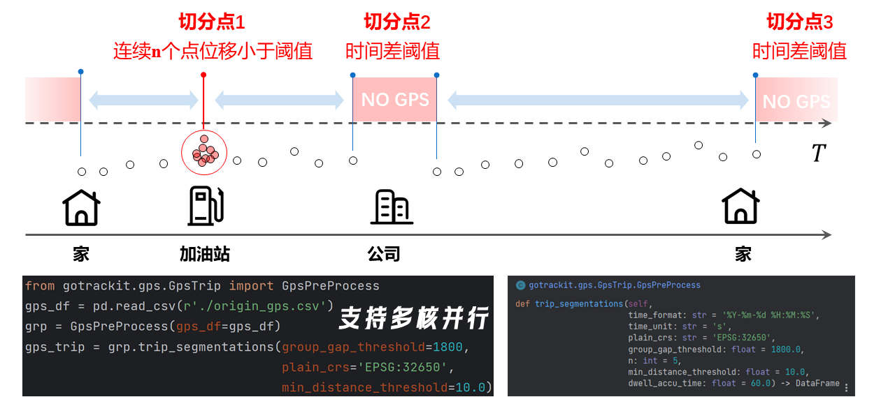

--------------------------------------------------------------------------------
Example of main trip: A car goes from home to the company, parks in the garage, and turns off the engine. The car no longer generates GPS data. It starts again after get off work and generates GPS data again. If the time difference between the last positioning point when arriving at the company in the morning and the first positioning point when starting the car after get off work exceeds group_gap_threshold, the main trip is divided here

Example of sub-trip: A car goes from home to the company. Before arriving at the company, it refuels at a gas station. GPS points continue to be generated, but the positioning points are concentrated near the gas station, resulting in a stop. Then from home to the gas station is a sub-trip

Each main trip and sub-trip has a globally unique agent_id

If you only want to divide the main trip, specify min_distance_threshold as a negative number


5.1.2. Initialize GpsPreProcess related parameters
::::::::::::::::::::::::::::::::::::::::::::::::::::::

* gps_df
    gps data table, type: pd.DataFrame, must be specified

* use_multi_core
    Whether to enable multi-core parallelism, default False, can be enabled when the amount of data is large

* used_core_num
    The number of enabled cores, default 2

5.1.3. Class method trip_segmentations related parameters
::::::::::::::::::::::::::::::::::::::::::::::::::::::::::::::::::

* time_unit, time_format
    GPS data related parameters, see: `MapMatch parameter explanation`_ in time_unit, time_format

* plain_crs
    According to the research scope, choose a suitable plane projection coordinate system

For coordinate system related parameter query, please refer to: `epsg.io <https://epsg.io/>`_, for coordinate system related knowledge explanation, please refer to: `Coordinate system introduction <https://mp.weixin.qq.com/s/Ot_Vo4CEtGYRblTMjMQYiw>`_

.. _6-degree zone division rule:
There are many kinds of plane projection coordinate systems. Here we only list the division of 6 degree zones. According to longitude, every 6 degrees corresponds to a plane projection coordinate system. You can refer to the following table to select according to the longitude and latitude of the center point of the research scope

If your research area is worldwide, then you can use EPSG:3857, which is a plane projection coordinate system applicable to any region in the world

.. csv-table:: 6 degree zone division
    :header: "Longitude range", "-180 ~ -174", "-174 ~ -168", "-168 ~ -162", "...", "108 ~ 114", "114 ~ 120", "120 ~ 126", "...", "174 ~ 180"
    :widths: 15, 15, 15, 15, 15, 15, 15, 15, 15, 15

    "6-degree band plane projection CRS name", "EPSG:32601", "EPSG:32602", "EPSG:32603", "...", "EPSG:32649", "EPSG:32650", "EPSG:32651", "...", "EPSG:32660"

* group_gap_threshold
    Time threshold, main trip division parameter, unit second, if the positioning time of the front and rear GPS points exceeds this threshold, the main trip is split at this point, the default is 1800s (30 minutes)

* min_distance_threshold
    Sub-trip segmentation distance threshold, in meters, default 10.0m

* dwell_accu_time
    Sub-trip segmentation time threshold, in seconds, default 60 seconds

* n
    Sub-trip segmentation parameter, integer, if the distance of more than n consecutive GPS points is less than min_distance_threshold and the duration exceeds dwell_accu_time, then the place is identified as a dwell point and the sub-trip is segmented from it, default 5

5.2. Track data cleaning
````````````````````````````````````````````````````````

To use gotrackit's track data cleaning module, make sure the input GPS data meets `GPS positioning data field requirements`_.

Using the TrajectoryPoints class provided by gotrackit, various preprocessing methods can be performed on trajectory data: interval sampling, stop point identification, sliding window averaging, trajectory point simplification, Kalman filter smoothing, these methods are encapsulated in the TrajectoryPoints class

The relevant parameters for initializing TrajectoryPoints are:

* gps_points_df
    gps data

* time_format
    The format string template of the time column in GPS data, the default is "%Y-%m-%d %H:%M:%S", you can refer to the format parameter of the pd.to_datetime() function in pandas

    Reference: `pd.to_datetime explanation <https://pandas.pydata.org/pandas-docs/version/0.20/generated/pandas.to_datetime.html#>`_, `ISO_8601 <https://en.wikipedia.org/wiki/ISO_8601>`_

* time_unit
    The unit of the time column in GPS data, If the time column is a numeric value (seconds or milliseconds, s or ms), the system will automatically build the time column according to this parameter, the default is 's'. Gotrackit will first try to use time_format to build the time column. If it fails, it will try to use time_unit to build the time column again.

* plain_crs:
    The plane projection coordinate system to be used, the default is None. If the user does not specify it, the program will automatically select the 6-degree projection zone based on the latitude and longitude range of the road network. It is recommended to use the program automatically

To specify manually: See: `6-degree zone division rule`_

TrajectoryPoints provides the following trajectory point cleaning methods:

5.2.1. Stop point deletion

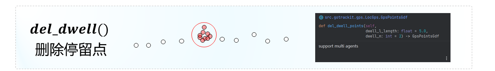

--------------------------------------------------------------------------------

* del_dwell_points():

    dwell_l_length: Dwell point identification distance threshold, default value 5.0m

    dwell_n: If the distance between more than dwell_n consecutive adjacent GPS points is less than dwell_l_length, then this group of points will be identified as a dwell point, default value 2


5.2.2. Track point densification
::::::::::::::::::::::::::::::::::::::::::::::::


--------------------------------------------------------------------------------

* dense():
    dense_interval: When the spherical distance L between adjacent GPS points exceeds dense_interval, the density is increased, and int(L / dense_interval) + 1 equal parts are encrypted. The default value is 100.0

5.2.3. Track point frequency reduction
:::::::::::::::::::::::::::::::::::::::::::::::::::::

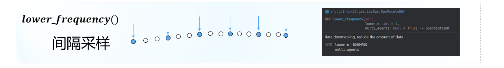

--------------------------------------------------------------------------------

* lower_frequency():
    lower_n: frequency reduction ratio, default 2

5.2.4. Sliding window smoothing
::::::::::::::::::::::::::::::::::::::::::::::::::::::::::

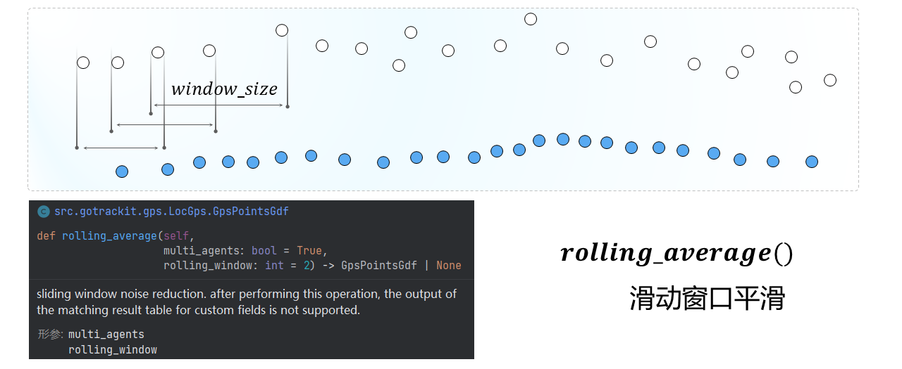

--------------------------------------------------------------------------------

* rolling_average():
    rolling_window: sliding window size, Default is 2

5.2.5. Offline Kalman filter smoothing
:::::::::::::::::::::::::::::::::::::::::::::::::

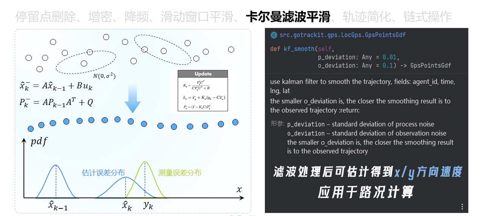

--------------------------------------------------------------------------------

* kf_smooth():

    p_deviation: Noise standard deviation of the transfer process, default is 0.01

    o_deviation: Noise standard deviation of the observation process, default is 0.1, the smaller the o_deviation, the closer the result after filtering and smoothing is to the observed trajectory (i.e. the source trajectory)

5.2.6. Trajectory simplification

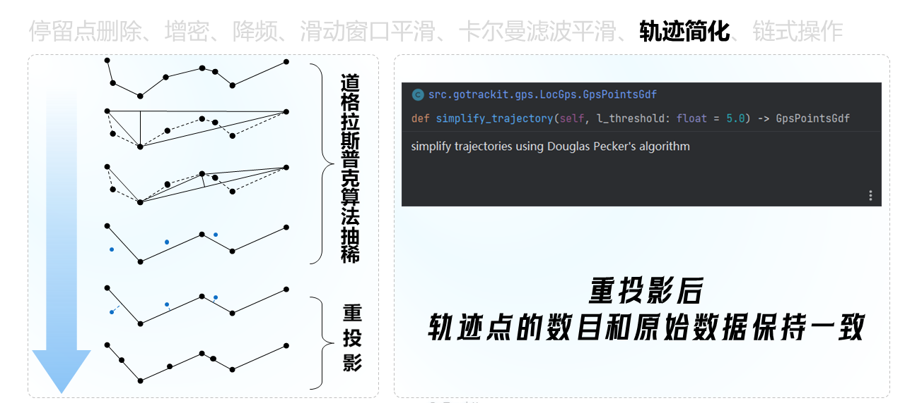

--------------------------------------------------------------------------------

* simplify_trajectory():

    l_threshold: Simplification threshold, default 5.0m


5.2.7. Trajectory cleaning and visualization
::::::::::::::::::::::::::::::::::::::::::::::::::::

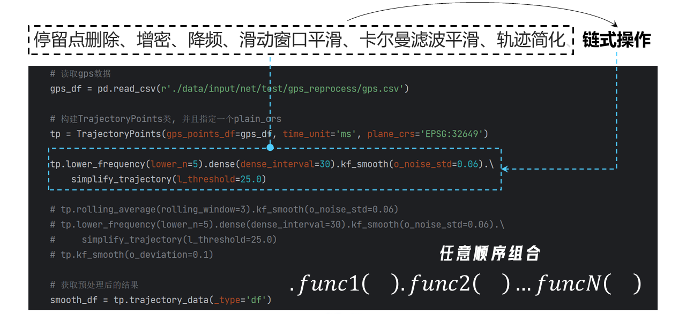

--------------------------------------------------------------------------------

The sample code is as follows:

.. code-block:: python
    :linenos:

    import pandas as pd
    from gotrackit.gps.Trajectory import TrajectoryPoints

    gps_df = pd.read_csv(r'gps.csv')

    # craeate TrajectoryPoints class and assign plain_crs
    tp = TrajectoryPoints(gps_points_df=gps_df, time_unit='ms', plain_crs='EPSG:32649')

    # Sample one point every 3 points
    # tp.lower_frequency(lower_n=3)


    # Kalman filter smoothing
    tp.kf_smooth()

    # Use chain operations to customize the order of preprocessing.
    # As long as kf_smooth() is the last step, the processed trajectory data can be used to obtain the xy speed data.
    # tp.rolling_average().kf_smooth()
    # tp.rolling_average().lower_frequency().kf_smooth()


    # Get the cleaned results
    # _type: df or gdf
    process_df = tp.trajectory_data(_type='df')

    out_fldr = r'./data/output/'

    # Save
    process_df.to_csv(os.path.join(out_fldr, r'after_reprocess_gps.csv'), encoding='utf_8_sig', index=False)

    # Export html to visualization
    tp.export_html(out_fldr=out_fldr, file_name='sample')

The output HTML file can dynamically visualize the comparison of track points before and after cleaning：


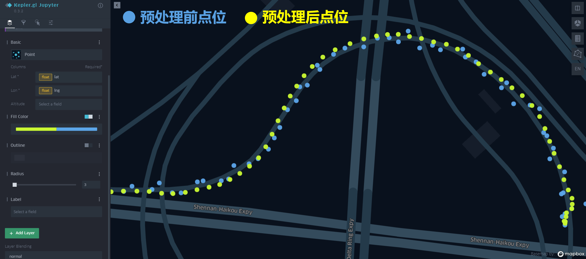

--------------------------------------------------------------------------------


.. _Map-Matching:

6. Offline map matching
-------------------------------------------------

.. note::

    In gotrackit version v0.3.8, the gps_df parameter of the map matching interface was changed from being initialized by the MapMatch class and passed in gps_df to being passed in the execute parameter

6.1. Required data
```````````````````````````

To use the map matching interface, you need to prepare road network data and GPS data.

Road network data requirements: `Road network data requirements`_, GPS data requirements: `GPS positioning data field requirements`_

The matching process architecture diagram is as follows:

.. image:: _static/images/MatchGraph.png
    :align: center

----------------------------------------

.. _Map matching parameter explanation:
The map matching parameters are composed of two parts: parameters for building Net and MapMatch function parameters

.. _Related parameters for building Net:

6.2. Matching interface parameter explanation - parameters for building Net
`````````````````````````````````````````````````````````````````````````````````````````````````

6.2.1. Road network parameters
::::::::::::::::::::::::::::::::::::::::::

* link_gdf
    Road network - link layer data, type: GeoDataFrame, only one of link_path can be specified, it is recommended to use the method of passing in link_gdf

* node_gdf
    Road network - node layer data, type: GeoDataFrame, only one of node_path can be specified. It is recommended to pass in node_gdf

* link_path
    File path of road network link layer data

* node_path
    File path of road network node layer data

6.2.2. Truncation search parameters
:::::::::::::::::::::::::::::::::::::::::::::

* cut_off
    Path search cutoff length, meters, default 1200.0m

* not_conn_cost
    Cost of disconnected paths, default 1000.0m

6.2.3. Path pre-calculation parameters
:::::::::::::::::::::::::::::::::::::::::::::

* fmm_cache
    Whether to enable pre-calculation. If enabled, the pre-calculation results will be cached under fmm_cache_fldr. Default False

* fmm_cache_fldr
    The directory for storing precalculated results, default is ./

* recalc_cache
    Whether to recalculate, default is True. When the value is False, gotrackit will read the cache from fmm_cache_fldr. If it cannot be read, it will automatically recalculate

* cache_cn
    An integer greater than 0, indicating how many cores are used for path precalculation, the default is 2

* cache_slice
    An integer greater than 0, indicating that the path result is divided into cache_slice parts for data standardization (increasing this value in large-scale road networks can prevent memory overflow)

6.2.4. Hierarchical spatial index parameters
::::::::::::::::::::::::::::::::::::::::::::::::::::

* is_hierarchical
    Whether to enable hierarchical association. In the case of super-large road networks and long GPS tracks, it is turned on as True, which can significantly improve the spatial association efficiency of the self-subnetwork. The default is False

* grid_len
    The grid side length in hierarchical association (m), the default is 2000m, and the default is generally sufficient

6.2.5. Plane projection system parameters
::::::::::::::::::::::::::::::::::::::::::::::::

* plain_crs
    The plane projection coordinate system to be used, the default is None. If the user does not specify, the program will automatically select the 6-degree projection zone based on the latitude and longitude range of the road network. It is recommended to use the program automatically

    If you want to specify manually: See: `6-degree zone division rules`_

As of v0.3.5, users can only specify the above 14 parameters by themselves. Other parameters are built-in parameters (some parameters have not been enabled yet), and users cannot specify them by themselves!

.. _MapMatch parameter explanation:

6.3. Matching interface parameter explanation - MapMatch parameter explanation
``````````````````````````````````````````````````````````````````````````````````````````````````````````````````

6.3.1. Project tag parameter
* flag_name
    Flag character name, will be used to mark the output visualization file, default is "test"

6.3.2. Basic parameters (must be specified)
:::::::::::::::::::::::::::::::::::::::::::::::::::

* net
    gotrackit network object, must be specified

* use_sub_net
    bool, whether to perform calculations on the subnet, default True

6.3.3. Time column construction parameters
::::::::::::::::::::::::::::::::::::::::::::::::::::

* time_format
    The format string template for the time column in GPS data, default "%Y-%m-%d %H:%M:%S", refer to the format parameter of the pd.to_datetime() function in pandas

    Reference: `pd.to_datetime explanation <https://pandas.pydata.org/pandas-docs/version/0.20/generated/pandas.to_datetime.html#>`_, `ISO_8601 <https://en.wikipedia.org/wiki/ISO_8601>`_

* time_unit
    The unit of the time column in GPS data, If the time column is a numeric value (seconds or milliseconds, s or ms), the system will automatically construct the time column according to the parameter, the default is 's'. Gotrackit will first try to use time_format to build the time column. If it fails, it will try to use time_unit to build the time column again.

6.3.4. Candidate range parameters
:::::::::::::::::::::::::::::::::::::::::::::::::::::::::

* gps_buffer
    GPS search radius, in meters, means only the road segments within the gps_buffer meter range near each gps point are selected as preliminary candidate road segments, default 200.0m

* gps_route_buffer_gap
    Radius increment, the radius range of gps_buffer + gps_route_buffer_gap is used to calculate the subnetwork, default 15.0m

* top_k
    Select the nearest top_k road segments within the buffer range of each GPS point, default 20. Each GPS point establishes a circular buffer based on the specified gps_buffer. The road segments associated with the buffer are the preliminary candidate road segments of the GPS point. Then, the top_k road segments closest to the GPS point are selected as the final candidate road segments based on the top_k parameter.

    Note: For a road segment with dir of 0, it will actually be split into two road segments with opposite topologies. If 20 bidirectional road segments are associated with the buffer range of a certain GPS, top_k must be at least 40 to select these 20 bidirectional road segments as the final candidates.

6.3.5. Emission probability and state transition probability parameters
::::::::::::::::::::::::::::::::::::::::::::::::::::::::::::::::::::::::::::

* beta
    Value greater than 0, default 6.0m; the larger the value, the less sensitive the state transition probability is to the distance difference (meters, the difference between the path length of adjacent projection points and the spherical distance of adjacent GPS points)

* gps_sigma
    Value greater than 0, default 30.0m; the larger the value, the less sensitive the emission probability is to the distance (meters, the distance from the GPS point to the candidate section)

* dis_para
    Scaling factor of distance (m), value greater than 0, default 0.1

6.3.6. GPS preprocessing parameters - Dwell point processing
::::::::::::::::::::::::::::::::::::::::::::::::::::::::::::::::::::::::

* del_dwell
    Whether to identify and delete dwell points, default True

* dwell_l_length
    Dwell point identification distance threshold, default 10m

* dwell_n
    If the distance between more than dwell_n consecutive adjacent GPS points is less than dwell_l_length, then this group of points will be identified as dwell points, default 2

6.3.7. GPS preprocessing parameters - point frequency reduction
::::::::::::::::::::::::::::::::::::::::::::::::::::::::::::::::::::::::::::

* is_lower_f
    Whether to perform data frequency reduction on GPS data, applicable to: high frequency-high positioning error GPS data, default False

* lower_n
    Downsampling ratio, default 2

6.3.8. GPS preprocessing parameters - sliding window average
::::::::::::::::::::::::::::::::::::::::::::::::::::::::::::::::::::::::::

* is_rolling_average
    Whether to enable sliding window average to reduce noise for GPS data, default False

* window
    Sliding window size, default 2

6.3.9. GPS preprocessing parameters - point density
:::::::::::::::::::::::::::::::::::::::::::::::::::::::::::::::::::

* dense_gps
    Whether to densify GPS data, default True

* dense_interval
    When the spherical distance L of adjacent GPS points exceeds dense_interval, it will be densified, int(L / dense_interval) + 1 Equal encryption, default 100.0

.. image:: _static/images/gps_process.jpg
    :align: center

----------------------------------------

6.3.10. Emission Probability Correction - Heading Angle Correction
::::::::::::::::::::::::::::::::::::::::::::::::::::::::::::::::::::::::::::::::::::::::::::::::::::::::::::::

* use_heading_inf
    Whether to use GPS differential direction vector to correct the emission probability (roughly estimate the heading angle using the GPS before and after points), applicable to: low positioning error GPS data or low frequency positioning data (with encryption parameters), default False

* heading_para_array
    Differential direction correction parameters, default np.array([1.0, 1.0, 1.0, 0.9, 0.8, 0.7, 0.6, 0.6, 0.5])

* omitted_l
    The unit is meter. If the average distance between the previous and next GPS points is less than this value, the heading angle of the GPS point is considered inaccurate and the heading angle limit will not be applied at this point. The default value is 6.0m.

Explanation of the direction correction coefficient:

.. image:: _static/images/heading_para_1.png
    :align: center

----------------------------------------

.. image:: _static/images/heading_para_2.png
    :align: center

----------------------------------------------


6.3.11. Result output setting parameters
:::::::::::::::::::::::::::::::::::::::::::::::::::

* instant_output
    Whether to store csv matching results after each matching track, default is False. If there are many agents to be matched, specifying this parameter as True may cause the matching results to accumulate in the memory, which may cause memory overflow. If it is specified as False, the matching result table will be stored after each agent is matched to avoid accumulation in the memory

* visualization_cache_times
    After matching visualization_cache_times agents, the results (html, geojson visualization results) are stored uniformly (concurrent storage is possible), default is 50

* out_fldr
    The directory where the matching results are saved (html files, geojson files, csv files), default is the current directory

* user_field_list
    The list of fields that can be output with the matching results in the GPS data table, for example: ['gps_speed', 'origin_agent'], if the sliding window average is enabled, this parameter will automatically become invalid, default is None

These fields must actually exist in the gps table

6.3.12. Visualization output parameters
:::::::::::::::::::::::::::::::::::::::::::::::

* export_html
    Whether to output the web page visualization result html file, default True

* use_gps_source
    Whether to use GPS source data for display in HTML visualization results, default False

* export_all_agents
    Whether to store the visualization of all agents in an html file

* gps_radius
    The radius of the GPS point in HTML visualization, in meters, default 8 meters

* export_geo_res
    Whether to output the geojson geometry visualization file of the matching result, default False

* heading_vec_len
    The length of the heading vector in the geojson geometry visualization file, default 15m

6.3.13. Grid parameter search settings
:::::::::::::::::::::::::::::::::::::::::::::::::::::::::

* use_para_grid
    Whether to enable grid parameter search

* para_grid
    Grid parameter object

6.3.14. execute - Execute matching parameters
::::::::::::::::::::::::::::::::::::::::::::::::::::::::::

* gps_df
    GPS data to be matched, type: pd.DataFrame

.. _Map matching code example:

6.4. Conventional matching code example
```````````````````````````````````````````````

The data file used is obtained from the Git repository: `QuickStart-Match-1 <https://github.com/zdsjjtTLG/TrackIt/tree/main/data/input/QuickStart-Match-1>`_

.. code-block:: python
    :linenos:

    # 1. 从gotrackit导入相关模块Net, MapMatch
    import pandas as pd
    import geopandas as gpd
    from gotrackit.map.Net import Net
    from gotrackit.MapMatch import MapMatch


    if __name__ == '__main__':

        # 1. Read GPS data
        # This is a file with GPS data of 10 vehicles, which has been cleaned and segmented
        # GPS data for map matching needs to be cleaned and segmented by the user
        gps_df = pd.read_csv(r'./data/output/gps/sample/example_gps.csv')
        print(gps_df)

        # 2.To build a net, the road network link layer and road network node layer must be in WGS-84, EPSG:4326 geographic coordinate system
        # Please pay attention to the encoding of the shp file. You can specify the encoding to ensure that there is no garbled code in the field.
        link = gpd.read_file(r'./data/input/net/xian/modifiedConn_link.shp')
        node = gpd.read_file(r'./data/input/net/xian/modifiedConn_node.shp')
        my_net = Net(link_gdf=link,
                     node_gdf=node)
        my_net.init_net()  # initialization

        # 3. map-match
        mpm = MapMatch(net=my_net, gps_buffer=100, flag_name='xa_sample',
               use_sub_net=True, use_heading_inf=True, omitted_l=6.0,
               del_dwell=True, dwell_l_length=50.0, dwell_n=0,
               export_html=True, export_geo_res=True, use_gps_source=True,
               export_all_agents=False,
               out_fldr=r'./data/output/match_visualization/xa_sample', dense_gps=False,
               gps_radius=15.0)

        # The first result returned is the matching result table
        # The second is the relevant information of the warning
        # The third is the ID number list of the agent with matching errors
        match_res, may_error_info, error_info = mpm.execute(gps_df=gps_df)
        print(match_res)
        match_res.to_csv(r'./data/output/match_visualization/xa_sample/match_res.csv', encoding='utf_8_sig', index=False)

6.4.1. Match result table (match_res) field meaning
::::::::::::::::::::::::::::::::::::::::::::::::::::::::::::::

.. csv-table:: Map match result table field description
    :header: "Field name", "Field meaning", "Field type"
    :widths: 15, 15, 40

    "agent_id","agent_id to which the gps point belongs","string"
    "seq","sequence ID of the gps point","int"
    "sub_seq","subsequence ID of the gps point, if the subsequence>0, it means that the point is a point that is supplemented after matching, called a supplementary point, and its projection point on the target section will not be calculated","int"
    "time","gps positioning time","datetime"
    "loc_type","gps point type, three categories: s: source GPS point, d: densification point, c: supplementary point","string"
    "link_id","link_id of the gps matching section, corresponding to the link_id field of the road network","int"
    "from_node","starting node of the gps matching section (indicating the starting point of the driving direction)","int"
    "to_node","end-to-end node of the gps matching section (indicating the end point of the driving direction)","int"
    "lng","longitude of the gps point, EPSG:4326","float"
    "lat","latitude of the gps point, EPSG:4326","float"
    "prj_lng","longitude of the gps point corresponding to the matching point on the matching section, EPSG:4326, the value of the supplementary point is empty","float"
    "prj_lat","latitude of the gps point corresponding to the matching point on the matching section, EPSG:4326, the value of the supplementary point is empty","float"
    "match_heading","The heading angle of the GPS matching point (the angle swept clockwise from the north direction, 0~360 degrees), the value of the supplementary point is empty","float"
    "dis_to_next","The path distance between the GPS projection point and the subsequent adjacent GPS projection point (excluding the supplementary point), the value of the supplementary point is empty","float"
    "route_dis","The path distance between the GPS matching point on the matching section and the starting point of the section, the value of the supplementary point is empty","float"
    "Other user-specified output fields", "Refer to the parameter user_field_list", "user diy"


About sub_seq (sub_seq >= 1 is a supplementary point, which has no practical meaning and is only for the neatness of the output format):

.. image:: _static/images/gps_segmentize.png
    :align: center

--------------------------------------------------------------------------------

.. note::

    For a two-way road section with dir=0, for example: link_id=12, from_node=2, to_node=3, when link_id=12 is matched in the matching result, its (from_node, to_node) may be (2, 3) or (3, 2), which is determined by the actual driving direction of the GPS

6.4.2. Meaning of warning information and error information
::::::::::::::::::::::::::::::::::::::::::::::::::::::::::::::::

The map matching interface will return three results, the first is the matching result table, the second is the relevant information of the warning, and the third is the list of agent_id numbers where the matching error occurred

* Warning information
    The matching results of the agent that has a warning, together with the agent without any warning, will be output in match_res

    The data structure of the warning information may_error_info is a dictionary: the key represents the agent_id, and the value is a table that records the road section information where the current agent has a warning during the matching process (can be visualized in HTML)

    For an example explanation of the value (a DataFrame), take the first line of the following figure as an example. A line represents a warning. We only care about the 2nd to 3rd elements of the from_ft column and to_ft column values ​​(the starting node of the road section), matching link(605186, 596721) to The matching links (98359, 258807) are not connected, indicating that there may be missing sections.

.. code-block:: python
    :linenos:

    UserWarning: gps seq: 10 -> 11 state transfer problem, from_link:(605186, 596721) -> to_link:(98359, 258807)
    UserWarning: gps seq: 111 -> 112 state transfer problem, from_link:(150627, 38018) -> to_link:(78195, 26627)

.. image:: _static/images/warn_info.jpg
    :align: center

-----------------------------------------------------

* Error message
    The data structure of error_info is a list, which records the agent_id where the match error occurred. Generally, the GPS data cannot be associated with any road network, or there are less than two GPS data points, or there are overlapping breakpoints in the road network link layer. For these errors, gotrackit will output an error message and skip the match.


6.5. Accelerate matching - enable pre-calculation
````````````````````````````````````````````````````````

.. note::

    Enable pre-calculation. If the network is large, it will have higher requirements on the computer's memory size. If the memory overflows during the calculation process, please try to increase cache_cn and cache_slice when initializing Net, or reduce cut_off

During the map matching process, the following two calculation processes have high overhead:

* Calculation of projection parameters from GPS points to adjacent candidate sections

* Calculation of the shortest path between candidate sections

However, in the process of matching vehicles of different agents, many parts of this part of the calculation are repeated calculation items. So can we pre-calculate all possible shortest paths and projection parameters based on a pre-calculation idea? We may only need to spend a little more time to pre-calculate before matching, and then store these pre-calculated results on disk. In the future, before each match, we only need to read the pre-calculated results once and load them into memory. We can get these shortest path results and projection parameter results with O(1) time complexity. gotrackit implements this process. The following code is the matching method using pre-calculation:

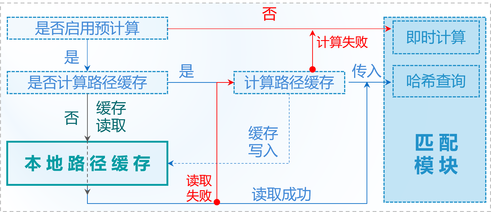

-----------------------------------------------------

.. note::

    Whenever there is any change in the road network, please recalculate the path cache

.. note::

    To calculate the path cache, please make sure that your road segment line type has no duplicate points. You can use `clean the road network link layer data`_


.. code-block:: python
    :linenos:

    if __name__ == '__main__':
        # Specify the fmm_cache parameter as True when building the net, which means pre-calculation is performed when building the net object this time
        # Please pay attention to the encoding of the shp file, you can specify the encoding explicitly to ensure that the fields are not garbled
        link = gpd.read_file(r'./data/input/net/xian/modifiedConn_link.shp')
        node = gpd.read_file(r'./data/input/net/xian/modifiedConn_node.shp')
        my_net = Net(link_gdf=link,
                     node_gdf=node,
                     fmm_cache=True, fmm_cache_fldr=r'./data/input/net/xian/', recalc_cache=True,
                     cut_off=800.0,
                     cache_slice=6)
        my_net.init_net()  # net initialization

        # fmm_cache_fldr is used to specify the file directory for storing pre-calculated results
        # cut_off is 800m, which means that during the shortest path search, only the paths with the shortest path distance less than 800.0m are calculated (considering that the distance span between adjacent GPS points will not be too large)
        # cache_slice=6, which means that the path results are divided into 6 parts for data standardization (to prevent memory overflow in large-scale road networks)

After the execution of the above network construction code, two pre-calculation result files will be generated under r'./data/input/net/xian/'.

The author uses Shenzhen's road network (90,000 links, 80,000 nodes), and the pre-calculation time is about two minutes. If there is no change in the road network used, the path of the pre-calculation result can be directly specified when using the road network for matching next time. At this time, directly specify recalc_cache=False, which means to read the pre-calculation result directly from fmm_cache_fldr, and no longer repeat the pre-calculation process.


.. code-block:: python
    :linenos:

    if __name__ == '__main__':
        # Specify the fmm_cache parameter as True when building the net, which means pre-calculation is performed when building the net object this time
        # Please pay attention to the encoding of the shp file, you can specify the encoding explicitly to ensure that the fields are not garbled
        link = gpd.read_file(r'./data/input/net/xian/modifiedConn_link.shp')
        node = gpd.read_file(r'./data/input/net/xian/modifiedConn_node.shp')
        my_net = Net(link_gdf=link,
                     node_gdf=node,
                     fmm_cache=True, fmm_cache_fldr=r'./data/input/net/xian/', recalc_cache=False)
        my_net.init_net()  # net initialization

        # recalc_cache=False means to read the precalculated results directly from fmm_cache_fldr, without repeating the precalculation process

        # At this time, the incoming net contains the pre-calculated results, and the matching speed will be improved
        mpm = MapMatch(net=my_net, gps_buffer=100, flag_name='xa_sample',
               use_sub_net=True, use_heading_inf=True, omitted_l=6.0,
               del_dwell=True, dwell_l_length=50.0, dwell_n=0,
               export_html=True, export_geo_res=True, use_gps_source=True,
               export_all_agents=False,
               out_fldr=r'./data/output/match_visualization/xa_sample', dense_gps=False,
               gps_radius=15.0)
        match_res, may_error_info, error_info = mpm.execute(gps_df=gps_df)
        print(match_res)

The meanings of the pre-calculation related parameters when building Net are as follows:

* fmm_cache
    Whether to enable path cache pre-calculation, default False

* cache_cn
    How many cores to use for path pre-calculation, default 2

* fmm_cache_fldr
    The file directory for storing path pre-calculation results, default ./

* recalc_cache
    Whether to recalculate the path cache, default True

* cut_off
    Path search cutoff length, meters, default 1200.0m

* cache_name
    The name of the path pre-storage flag, default cache, the names of the two cache files: {cache_name}_path_cache, {cache_name}_prj

* cache_slice
    Slice the cache (cut into cache_slice parts) and convert the format for storage (to prevent memory overflow caused by large-scale road networks), default 2 * cache_cn, if memory overflow, you can increase this value

6.6. Accelerated Matching - Enable Multi-core for Parallel Matching
```````````````````````````````````````````````````````````````````````````

If you want to enable parallel matching on multiple tracks, please replace mpm.execute() with mpm.multi_core_execute(core_num=x). When the number of your agents is greater than 50, the efficiency improvement of multi-core will be more obvious


.. code-block:: python
    :linenos:

    # 1. 从gotrackit导入相关模块Net, MapMatch
    import pandas as pd
    import geopandas as gpd
    from gotrackit.map.Net import Net
    from gotrackit.MapMatch import MapMatch


    if __name__ == '__main__':

        # 1. Read GPS data
        # This is a file with GPS data of 150 vehicles
        gps_df = pd.read_csv(r'./data/output/gps/150_agents.csv')
        print(gps_df)

        # 2.To build a net, the road network link layer and road network node layer must be in WGS-84, EPSG:4326 geographic coordinate system
        # Please pay attention to the encoding of the shp file. You can specify the encoding to ensure that there is no garbled code in the field.
        link = gpd.read_file(r'./data/input/net/xian/modifiedConn_link.shp')
        node = gpd.read_file(r'./data/input/net/xian/modifiedConn_node.shp')
        my_net = Net(link_gdf=link,
                     node_gdf=node,
                     fmm_cache=True, fmm_cache_fldr=r'./data/input/net/xian/', recalc_cache=False)
        my_net.init_net()  # net initialization

        # 3. map-match
        mpm = MapMatch(net=my_net, gps_buffer=100, flag_name='xa_sample',
               use_sub_net=True, use_heading_inf=True,
               omitted_l=6.0, del_dwell=True, dwell_l_length=25.0, dwell_n=1,
               lower_n=2, is_lower_f=True,
               is_rolling_average=True, window=3,
               dense_gps=False,
               export_html=False, export_geo_res=False, use_gps_source=False,
               out_fldr=r'./data/output/match_visualization/xa_sample',
               gps_radius=10.0)

        match_res, may_error_info, error_info = mpm.multi_core_execute(gps_df=gps_df, core_num=6)
        print(match_res)
        match_res.to_csv(r'./data/output/match_visualization/xa_sample/match_res.csv', encoding='utf_8_sig', index=False)


* core_num
    How many cores to use for matching, default is 1

6.7. Accelerated matching - simplified road network line-geo
`````````````````````````````````````````````````````````````````````````````

You can use the following method to simplify the geometry of the road network link layer


.. code-block:: python
    :linenos:

    import pandas as pd
    import geopandas as gpd
    from gotrackit.map.Net import Net
    from gotrackit.MapMatch import MapMatch


    if __name__ == '__main__':

        link = gpd.read_file(r'./data/input/net/xian/modifiedConn_link.shp')
        node = gpd.read_file(r'./data/input/net/xian/modifiedConn_node.shp')

        # Simplify the line type appropriately. The unit of x in simplify(x) is m.
        # This interface will use the Douglas-Peucker algorithm to simplify the line type.
        # If this value is too large, all links will degenerate into straight lines.
        link = link.to_crs('The coordinate system of your chosen planar projection')
        link['geometry'] = link['geometry'].simplify(1.0)
        link = link.to_crs('EPSG:4326')
        my_net = Net(link_gdf=link, node_gdf=node)
        my_net.init_net()  # net initialization

        # map-match
        mpm = MapMatch(net=my_net, gps_buffer=100, flag_name='xa_sample',
               use_sub_net=True, use_heading_inf=True,
               omitted_l=6.0, del_dwell=True, dwell_l_length=25.0, dwell_n=1,
               lower_n=2, is_lower_f=True,
               is_rolling_average=True, window=3,
               dense_gps=False,
               export_html=False, export_geo_res=False, use_gps_source=False,
               out_fldr=r'./data/output/match_visualization/xa_sample',
               gps_radius=10.0)

        match_res, may_error_info, error_info = mpm.execute(gps_df=gps_df)
        print(match_res)
        match_res.to_csv(r'./data/output/match_visualization/xa_sample/match_res.csv', encoding='utf_8_sig', index=False)

6.8. Accelerate matching - use hierarchical index to accelerate spatial association efficiency
`````````````````````````````````````````````````````````````````````````````````````````````````````````````````````

Suitable for long trajectory matching under ultra-large-scale networks, which can reduce the spatial association time overhead of sub-networks. When initializing Net, specify is_hierarchical as True to enable spatial hierarchical indexing

6.9. Use grid parameters to determine reasonable matching parameters
`````````````````````````````````````````````````````````````````````````

This package supports grid search for the following four parameters in the map matching interface:

beta, gps_sigma, omitted_l, use_heading_inf

That is: traverse the possible combinations of these four parameters until there are no warnings in the matching result. If all parameter combinations have warnings, the matching result of the last parameter combination will be output, and the matching result will also return the number of matching warnings corresponding to the parameter combination

Using grid parameter search, you only need to build a grid parameter class and specify the value list of each parameter


.. code-block:: python
    :linenos:

    import pandas as pd
    import geopandas as gpd
    from gotrackit.map.Net import Net
    from gotrackit.MapMatch import MapMatch
    from gotrackit.model.Para import ParaGrid


    if __name__ == '__main__':

        gps_df = gpd.read_file(r'./data/output/gps/dense_example/test999.geojson')

        link = gpd.read_file(r'./data/input/net/xian/modifiedConn_link.shp')
        node = gpd.read_file(r'./data/input/net/xian/modifiedConn_node.shp')
        my_net = Net(link_gdf=link, node_gdf=node, fmm_cache=True,
                 recalc_cache=False, fmm_cache_fldr=r'./data/input/net/xian')
        my_net.init_net()


        # 3. Create a new grid parameter object
        # Specify the parameter value range list
        # Four parameter lists can be specified
        # beta_list: list[float] = None，gps_sigma_list: list[float] = None
        # use_heading_inf_list: list[bool] = None，omitted_l_list: list[float] = None
        pgd = ParaGrid(use_heading_inf_list=[False, True], beta_list=[0.1, 1.0], gps_sigma_list=[1.0, 5.0])

        # 4. map-match
        # 传入网格参数：use_para_grid=True, para_grid=pgd
         mpm = MapMatch(net=my_net, is_rolling_average=True, window=2, flag_name='dense_example',
                   export_html=True, export_geo_res=True,
                   gps_buffer=400,
                   out_fldr=r'./data/output/match_visualization/dense_example',
                   dense_gps=True,
                   use_sub_net=True, dense_interval=50.0, use_gps_source=False, use_heading_inf=True,
                   gps_radius=15.0, use_para_grid=True, para_grid=pgd)
        res, warn_info, error_info = mpm.execute(gps_df=gps_df)
        print(res)
        print(warn_info)
        print(error_info)
        print(pd.DataFrame(pgd.search_res))
        res.to_csv(r'./data/output/match_visualization/dense_example/match_res.csv', encoding='utf_8_sig', index=False)

        # You can view the number of warnings during the matching process under different parameter combinations
        print(pd.DataFrame(pgd.search_res))

When matching using parameter grid, the system will automatically combine parameters and output the number of warnings under different parameter combinations:

.. image:: _static/images/para_grid.jpg
    :align: center
-------------------------------------------------

.. _Visualization:

6.10. Visualization of matching results
`````````````````````````````````````````````

6.10.1 HTML animation visualization
::::::::::::::::::::::::::::::::::::::::::::::::

The parameter export_html in the map matching interface controls whether to output HTML animation (more time-consuming)

HTML visualization requires network connection, use a browser to open the generated html file, and click on the timeline player according to the figure below


.. image:: _static/images/可视化操作.gif
    :align: center
-----------------------------------------------

.. image:: _static/images/show.png
    :align: center
-----------------------------------------------

The html visualization file is an important file for us to check the matching results. It can clearly show the matching process:

`gotrackit map matching package parameter detailed explanation and problem troubleshooting <https://www.bilibili.com/video/BV1qK421Y7hV>`_

6.10.2 geojson vector file visualization
:::::::::::::::::::::::::::::::::::::::::::::::

The parameter export_geo_res in the map matching interface controls whether to output the matching result geojson vector layer (more time-consuming). The matching vector result of an agent consists of four files:

{flag_name}-{agent_id}-gps.geojson: gps point vector layer

{flag_name}-{agent_id} -match_link.geojson: match link vector layer

{flag_name}-{agent_id}-prj_l.geojson: projection line vector layer

{flag_name}-{agent_id}-prj_p.geojson: road segment matching point vector layer

{flag_name}-{agent_id}-heading_vec.geojson: road segment matching point heading vector

Can be visualized using GIS software, such as QGIS

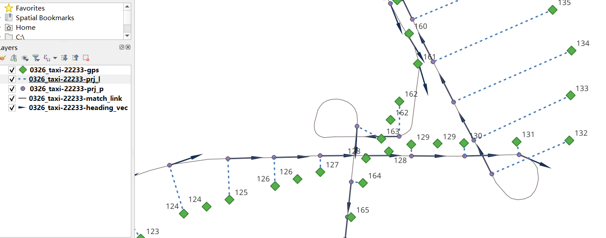
-----------------------------------------------


6.11. Parameter adjustment method for incorrect matching results
```````````````````````````````````````````````````````````````````````

6.11.1. Program prompts - less than two GPS points after preprocessing, unable to match
::::::::::::::::::::::::::::::::::::::::::::::::::::::::::::::::::::::::::::::::::::::::::::::::::::::::::::::::::::::

* The parameters of dwell point recognition may be unreasonable
    Maybe your GPS data is high-frequency positioning data, and the distance between adjacent points is less than dwell_l_length. At this time, you happen to have turned on the dwell point recognition function, and all GPS data is deleted as dwell points. You need to turn off the dwell point recognition switch and then turn on data downsampling. Macro road network matching does not require such high-frequency GPS positioning.

* It may be a source data problem
    It may be that the GPS data points of this vehicle are less than two

6.11.2. The matching path is not continuous in the html visualization result
:::::::::::::::::::::::::::::::::::::::::::::::::::::::::::::::::::::::::::::::::::::::::::::

* It may be that the values of gps_buffer and top_k are too small (70% of the errors may be caused by this reason)
    Each GPS point establishes a circular buffer based on the specified gps_buffer. The road segments associated with the buffer are the preliminary candidate road segments of the GPS point. Then, based on the top_k parameter, the top_k road segments closest to the GPS point are selected from the preliminary candidate road segments as the final candidate road segments.
    If the positioning error of the GPS itself is large and these two values are set relatively small, the correct road segment may not be selected as the final candidate road segment, resulting in discontinuous matching paths

    If the densification parameter is enabled, generally speaking, it is best to increase the values of gps_buffer and top_k


* It may be that the source track points are relatively sparse (the distance between adjacent GPS points is greater than 1000m), but the automatic densification of track points is not enabled
    Densify track points: dense_gps is specified as True; dense_interval is recommended to be 100 ~ 500, indicating that as long as the distance between adjacent GPS points exceeds dense_interval, densification will be performed between these two points

* It may be that cut_off is selected too small
    cut_off is the path search cutoff value, the default is 1200m

* It may be that the road network itself is not connected
    Check whether the road network is connected at the location where the path is disconnected. To check the connectivity, check the from_node and to_node field values of the link layer file

* It may be a problem with the time column of the GPS data
    It may be that the positioning time accuracy of your GPS data is not enough, such as the positioning time of the two points before and after is 2023-11-12 17:30, or both are 2023-11-12 17:30:55, this package will sort by time column when constructing GPS objects. The same positioning time may cause the actual order of two points to be reversed, thus affecting the matching, so make sure that the positioning time of your GPS data does not have the same value

* It may be that the stop point identification parameter settings are unreasonable
    Cause some normal positioning points to be identified as stop points and then deleted

* It may be that the gps_sigma and beta settings are unreasonable
    We call the distance from the GPS point to the candidate section prj_dis

    beta represents the penalty for discontinuity in matching paths. The larger this value is, the smaller the penalty is. When the GPS data error is large, there may be path discontinuity. At this time, you can reduce beta, increase the penalty for discontinuity, and increase gps_sigma (gps_sigma represents the penalty for prj_dis. The smaller the gps_sigma value is, the greater the penalty for prj_dis is), weakening the impact of GPS point positioning errors

    Reduce beta, increase gps_sigma, that is, increase gps_sigma/beta: The intuitive meaning is that it pays more attention to the continuity of the path and can tolerate a larger prj_dis (i.e., a larger positioning error)

    Increase beta and decrease gps_sigma, that is, reduce gps_sigma/beta: The intuitive meaning is that the algorithm tends to choose the road section with a small prj_dis as the matching result, and does not pay attention to the path continuity of the matching result. When gps_sigma approaches 0 and beta approaches infinity, the matching algorithm degenerates into the nearest neighbor matching

    Note: The size of gps_sigma and beta is relative. Generally, the default gps_sigma and beta are reasonable. Beta should not be less than 3, and gps_sigma should not be less than 15

* It may be that the not_conn_cost value is small when initializing the net
    This represents the penalty for path discontinuity. The larger the value, the greater the penalty, and the less likely it is to transfer to a discontinuous road section

* The path cache is not updated
    The path cache is enabled. After the road network structure changes, the path cache is not recalculated. The cache of the old version of the road network is actually used.

* Direction restriction may not be enabled
    Using_heading_inf is not enabled, or the heading_para_array setting is unreasonable

* Direction restriction is enabled but reasonable stop point deletion parameters and frequency reduction parameters are not selected
    Using_heading_inf is enabled, but the calculation of the differential heading angle is affected by the stop point at the intersection, resulting in distortion of the differential heading angle calculation

7. Real-time map matching
-------------------------------------------------

7.1. The difference between real-time and offline
```````````````````````````````````````````````````

Real-time Kalman filter:

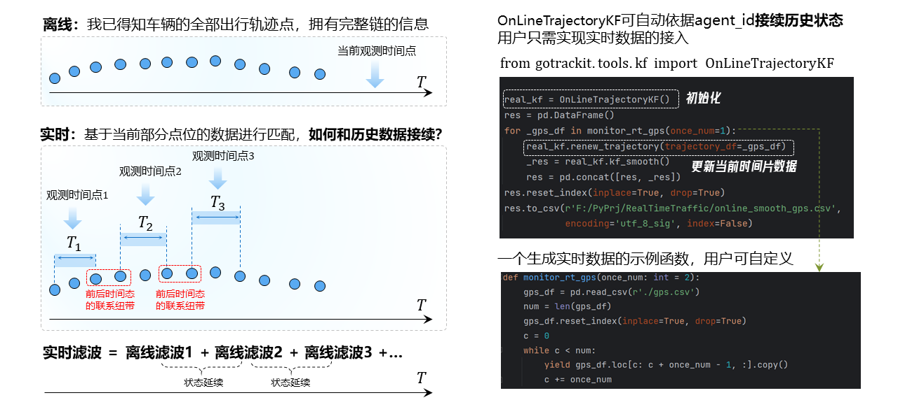
--------------------------------------------------------

Real-time matching:

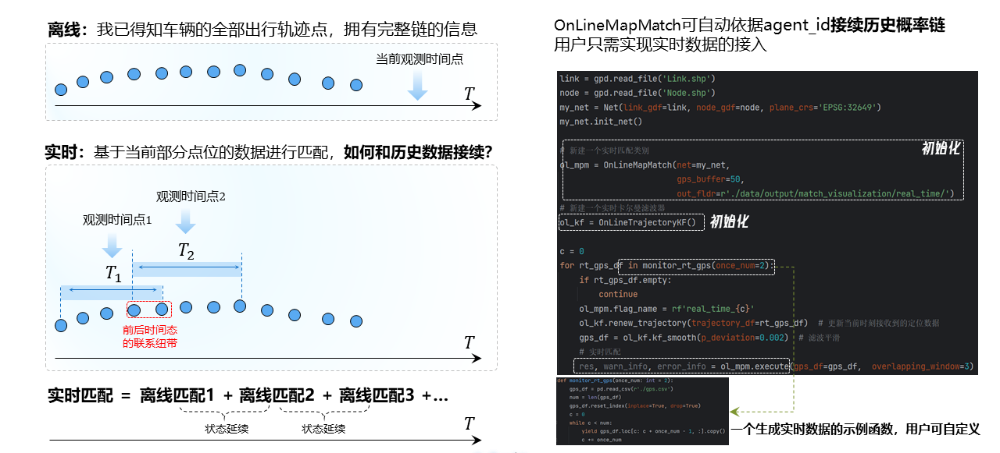
--------------------------------------------------------

7.2. Real-time Kalman filter
````````````````````````````````

To use the real-time Kalman filter, you need to introduce the OnLineTrajectoryKF class, which treats vehicle positioning points with the same agent_id as the same probability chain. The sample code is as follows


.. code-block:: python
    :linenos:

    # 1. 从gotrackit导入相关模块
    import pandas as pd
    from gotrackit.tools.kf import OnLineTrajectoryKF

    # 这是一个接入实时GPS数据的示例函数，用户需要自己依据实际情况去实现他
    def monitor_rt_gps(once_num: int = 2):
        gps_df = pd.read_csv(r'./gps.csv')
        num = len(gps_df)
        gps_df.reset_index(inplace=True, drop=True)
        c = 0
        while c < num:
            yield gps_df.loc[c: c + once_num - 1, :].copy()
            c += once_num

    if __name__ == '__main__':

        ol_kf = OnLineTrajectoryKF()
        res = pd.DataFrame()
        for _gps_df in monitor_rt_gps(once_num=1):
            if rt_gps_df.empty:
                continue
            ol_kf.renew_trajectory(trajectory_df=_gps_df)
            _res = ol_kf.kf_smooth()
            res = pd.concat([res, _res])
        res.reset_index(inplace=True, drop=True)
        res.to_csv(r'./online_smooth_gps.csv', encoding='utf_8_sig', index=False)


7.3. Real-time matching interface
````````````````````````````````````````
To use real-time map matching, you need to introduce the OnLineMapMatch class, which treats vehicle positioning points with the same agent_id as the same probability chain. The sample code is as follows

.. code-block:: python
    :linenos:

    # 1. 从gotrackit导入相关模块
    import pandas as pd
    import geopandas as gpd
    from gotrackit.map.Net import Net
    from gotrackit.MapMatch import OnLineMapMatch
    from gotrackit.tools.kf import OnLineTrajectoryKF

    # 这是一个接入实时GPS数据的示例函数，用户需要自己依据实际情况去实现它
    def monitor_rt_gps(once_num: int = 2):
        gps_df = pd.read_csv(r'./gps.csv')
        num = len(gps_df)
        gps_df.reset_index(inplace=True, drop=True)
        c = 0
        while c < num:
            yield gps_df.loc[c: c + once_num - 1, :].copy()
            c += once_num

    if __name__ == '__main__':

        link = gpd.read_file('Link.shp')
        node = gpd.read_file('Node.shp')
        my_net = Net(link_gdf=link, node_gdf=node)
        my_net.init_net()

        # 新建一个实时匹配类别
        ol_mpm = OnLineMapMatch(net=my_net, gps_buffer=50,
                                out_fldr=r'./data/output/match_visualization/real_time/')

        # 新建一个实时卡尔曼滤波器
        ol_kf = OnLineTrajectoryKF()

        c = 0
        for rt_gps_df in monitor_rt_gps(once_num=2):
            if rt_gps_df.empty:
                continue
            ol_mpm.flag_name = rf'real_time_{c}'

            # 更新当前时刻接收到的定位数据
            ol_kf.renew_trajectory(trajectory_df=rt_gps_df)

            # 滤波平滑
            gps_df = ol_kf.kf_smooth(p_deviation=0.002)

            # 实时匹配
            res, warn_info, error_info = ol_mpm.execute(gps_df=gps_df,  overlapping_window=3)


The execute function parameters of real-time map matching are explained as follows:

* gps_df
    gps data

* time_gap_threshold
    time threshold, default 1800.0s, if the difference between the earliest positioning time of the current GPS data of an agent and the latest positioning time of the previous batch of GPS data exceeds this value, the historical probability chain will not be referenced for matching calculation

* dis_gap_threshold
    distance threshold, default 600.0m, if the distance between the earliest positioning point of the current GPS data of an agent and the latest positioning point of the previous batch of GPS data exceeds this value, the historical probability chain will not be referenced for matching calculation

* overlapping_window: int = 3
    overlapping window length, default 3, overlapping window with historical GPS data