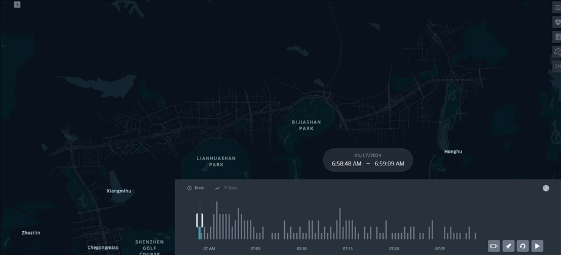
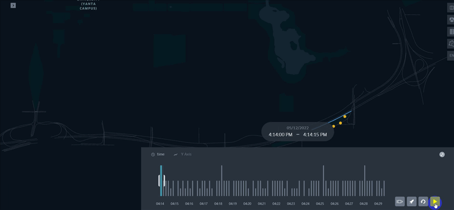
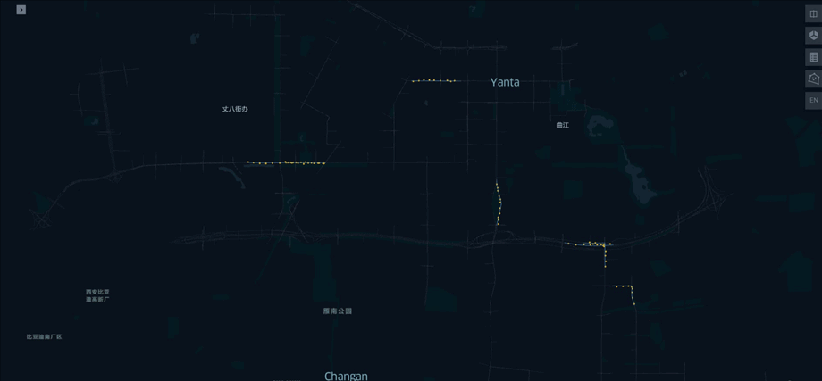
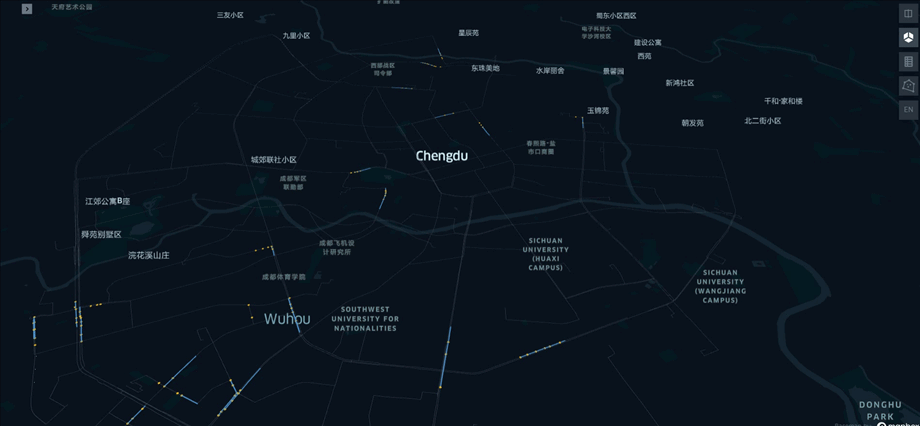
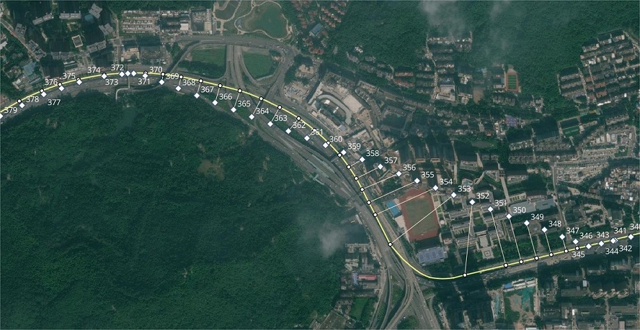
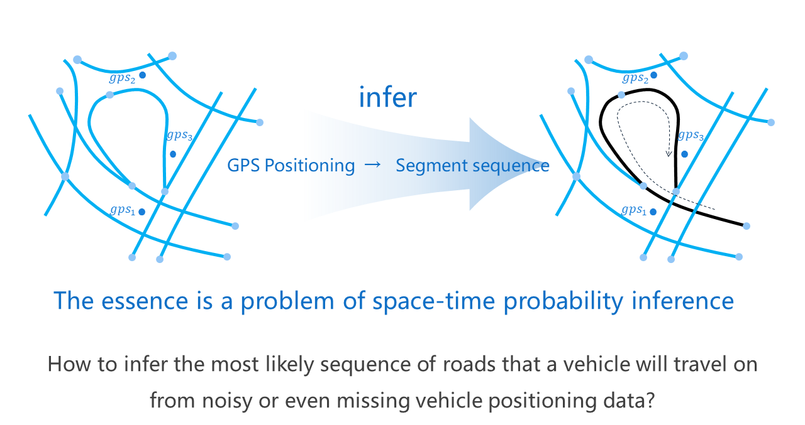

💡Introduction
==================================

1. About gotrackit
------------------------------
This map matching package implements the probability modeling of continuous GPS points based on the hidden Markov model (HMM). This package can be used to easily map match GPS data. The features of this open source package are as follows:

* Data worry-free😻
    Provides a large number of road network processing optimization tools.

    Provides a GPS sample data production module to solve the problem of no GPS data;

    Provides a GPS data cleaning interface, including itinerary segmentation, sliding window noise reduction, data frequency reduction, stop point identification, and point density increase.

* Complete documentation☑️
    Chinese documentation with detailed operation instructions;

    The algorithm principle explanation part does not involve complex formula derivation, and uses animation to analyze the algorithm principle, which is concise and clear.

* Matching algorithm optimization🚀
    Support FastMapMatching based on path pre-storage, support multi-core parallel matching, support grid parameter search;

    The preliminary path based on HMM matching has been optimized, and the disconnected locations will be automatically searched and completed. For the locations that are disconnected in the actual road network, warning information will be output to facilitate users to trace back the problem.

* Matching results support animation visualization🌈
    The matching results provide three output forms: GPS point matching result table (csv), matching result vectorized layer, vector layer matching animation (HTML file). HTML animation allows users to intuitively experience the matching results and improve the efficiency of troubleshooting.

-------------------------------------

-------------------------------------

-------------------------------------

-------------------------------------

-------------------------------------

-------------------------------------

2. Map matching problem
----------------------------------

The map matching problem refers to: how to infer the actual road section of the vehicle from the continuous vehicle GPS positioning information, and normalize the GPS positioning data into a road section spatiotemporal sequence.

The GPS data generated by the vehicle will have positioning errors, which are often quite different from the actual location. When the road network density is high, the nearest neighbor matching effect will be very poor, and the nearest neighbor matching algorithm is extremely unstable and does not fully exploit the connectivity between GPS points.

-----------------------------------------------------

In order to accurately obtain the actual road section trajectory of the vehicle, our matching algorithm cannot only consider single-point information, but must look at the overall situation. Single-point errors are inevitable, and the information obtained from long-term continuous observations can fully smooth these errors. Therefore, probabilistic graph modeling based on continuous states is our technical route.

3. Related video tutorials
------------------------------------

`Animated version of map matching algorithm based on Hidden Markov Model (HMM)! If you can't learn it, come and beat me! <https://www.bilibili.com/video/BV1gQ4y1w7dC>`_

`A python package to get road network + map matching! <https://www.bilibili.com/video/BV1nC411z7Vg>`_

`Detailed explanation of gotrackit map matching package parameters and troubleshooting <https://www.bilibili.com/video/BV1qK421Y7hV>`_

`QGIS road network topology display, base map loading, style reuse, map saving <https://www.bilibili.com/video/BV1Sq421F7QX>`_

.. [Ref] 《Hidden Markov map matching through noise and sparseness》,Paul Newson & John Krumm