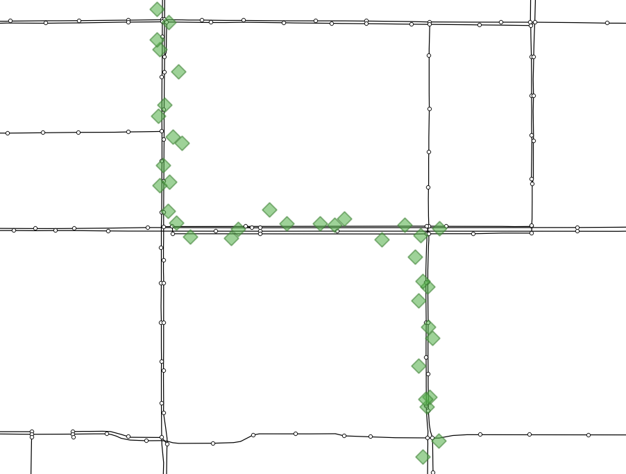
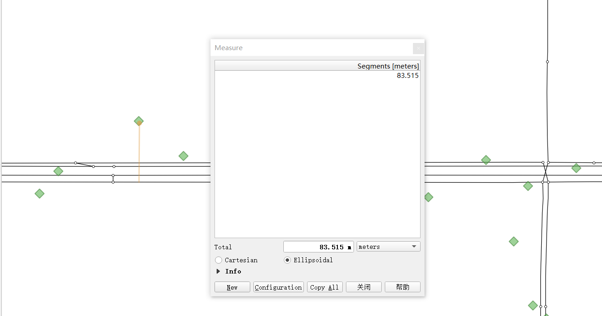
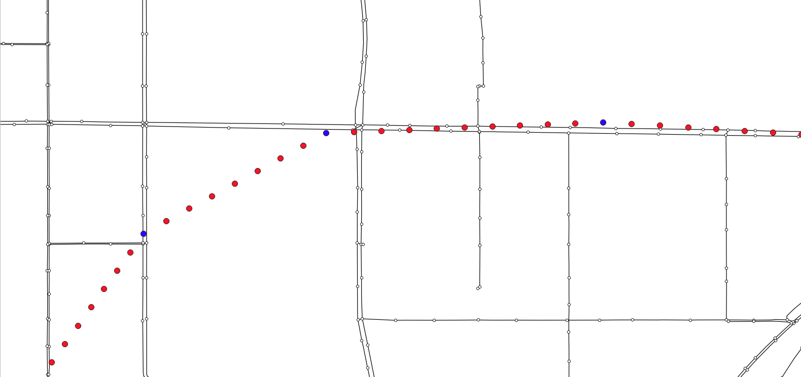
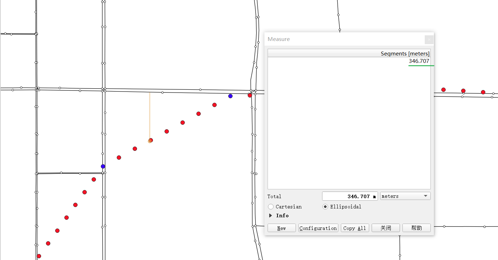
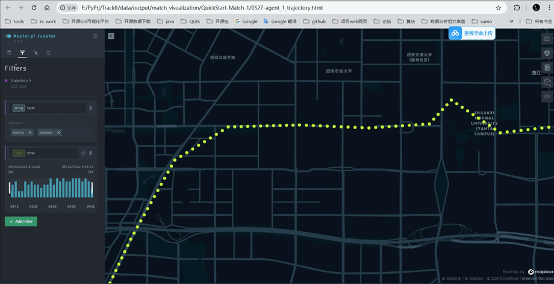

⚡️ QuickStart
===================================


1. Map Matching Example
----------------------------

1.1. install gotrackit
```````````````````````
Installation tutorial see：:doc:`HowToUse`


1.2. data download
```````````````````````
Download sample data from GitHub repository：`QuickStart-Match-1 <https://github.com/zdsjjtTLG/TrackIt/tree/main/data/input/QuickStart-Match-1>`_


1.3. Match code 1 - non-sparse gps data
```````````````````````````````````````````
.. code-block:: python
    :linenos:


    import pandas as pd
    import geopandas as gpd
    from gotrackit.map.Net import Net
    from gotrackit.MapMatch import MapMatch
    from gotrackit.gps.Trajectory import TrajectoryPoints

    if __name__ == '__main__':

        # read gps data
        gps_df = pd.read_csv(r'./data/input/QuickStart-Match-1/example_gps.csv')

        # Use GPS data to build TrajectoryPoints and clean the data
        # Whether this step is necessary depends on the actual situation
        tp = TrajectoryPoints(gps_points_df=gps_df, plain_crs='EPSG:32649')
        tp.lower_frequency(lower_n=2).kf_smooth(o_deviation=0.3)  # 由于样例数据定位频率高且有一定的误差，因此先做间隔采样然后执行滤波平滑
        gps_df = tp.trajectory_data(_type='df')

        # Read the road network data and build the Net class and initialize it
        link = gpd.read_file(r'./data/input/net/xian/modifiedConn_link.shp')
        node = gpd.read_file(r'./data/input/net/xian/modifiedConn_node.shp')
        my_net = Net(link_gdf=link, node_gdf=node, not_conn_cost=1200)
        my_net.init_net()  # net初始化

        # Build a matching class
        # Specify the HTML visualization file to be output
        # Specify the project flag character flag_name='general_sample', which can be customized by the user
        # The values of the gps data time column are all in the form of 2022-05-12 16:27:46, so the specified time column format is '%Y-%m-%d %H:%M:%S'
        # Regarding the determination of gps_buffer, the road network and gps data need to be visualized together using gis software to roughly determine the distance between GPS data and candidate sections
        mpm = MapMatch(net=my_net, gps_buffer=120, flag_name='general_sample', time_format='%Y-%m-%d %H:%M:%S',
                       use_heading_inf=True, omitted_l=6.0, export_html=True, del_dwell=False,
                       out_fldr=r'./data/output/match_visualization/QuickStart-Match-1', dense_gps=False,
                       gps_radius=20.0)

        # Execute matching
        # The first result returned is the matching result table
        # The second is the information about the agent that issued the warning ({agent_id1: pd.DataFrame(), agent_id2: pd.DataFrame()...})
        # The third is the ID list of the agent that failed to match (the number of GPS points after preprocessing (or raw data) is less than 2)
        match_res, warn_info, error_info = mpm.execute(gps_df=gps_df)
        match_res.to_csv(fr'./data/output/match_visualization/QuickStart-Match-1/general_match_res.csv',
                         encoding='utf_8_sig', index=False)

How to determine gps_buffer is related to the size of the GPS positioning error. As shown in the figure below, we visualize the GPS data and the road network together in QGIS



--------------------------------------------------------------------------------

It can be seen that the positioning frequency of GPS points is not low, and the positioning point is not far from the road, about 85 meters. In order to ensure that all GPS points can be associated with the candidate road sections, it is more appropriate to take gps_buffer=120 meters




--------------------------------------------------------------------------------


1.4. Match code 2 - sparse gps data
``````````````````````````````````````
.. code-block:: python
    :linenos:

    import pandas as pd
    import geopandas as gpd
    from gotrackit.map.Net import Net
    from gotrackit.MapMatch import MapMatch
    from gotrackit.gps.Trajectory import TrajectoryPoints


    if __name__ == '__main__':
        # read gps data
        gps_df = pd.read_csv(r'./data/input/QuickStart-Match-1/example_sparse_gps.csv')

        # Use GPS data to construct TrajectoryPoints. Whether this step is necessary depends on the actual situation.
        tp = TrajectoryPoints(gps_points_df=gps_df, plain_crs='EPSG:32649')
        tp.dense(dense_interval=120)  # 由于样例数据是稀疏定位数据，我们在匹配前进行增密处理
        gps_df = tp.trajectory_data(_type='df')
        tp.export_html(out_fldr=r'./data/output/match_visualization/QuickStart-Match-1')  # 输出增密前后的轨迹对比

        # Read the road network data and build the Net class and initialize it
        link = gpd.read_file(r'./data/input/net/xian/modifiedConn_link.shp')
        node = gpd.read_file(r'./data/input/net/xian/modifiedConn_node.shp')
        my_net = Net(link_gdf=link, node_gdf=node, not_conn_cost=1200)
        my_net.init_net()  # net初始化

        # Since most of the track points are densified points, we need to increase gps_buffer to ensure that the track points are associated with the road segments
        # Since we have already densified the GPS data in advance, we do not need to use the densification in MapMatch - dense_gps=False
        mpm = MapMatch(net=my_net, gps_buffer=700, top_k=20, flag_name='sparse_sample',
                       export_html=True, time_format='%Y-%m-%d %H:%M:%S',
                       out_fldr=r'./data/output/match_visualization/QuickStart-Match-1', dense_gps=False,
                       gps_radius=15.0)

        # Execute matching
        # The first result returned is the matching result table
        # The second is the information about the agent that issued the warning ({agent_id1: pd.DataFrame(), agent_id2: pd.DataFrame()...})
        # The third is the ID list of the agent that failed to match (the number of GPS points after preprocessing (or raw data) is less than 2)
        match_res, warn_info, error_info = mpm.execute(gps_df=gps_df)
        match_res.to_csv(fr'./data/output/match_visualization/QuickStart-Match-1/general_match_res.csv',
                         encoding='utf_8_sig', index=False)


As shown in the figure below, we can see that after the GPS points are densified, the densified points are far away from the candidate sections, about 350 meters (the blue points are the source data points, and the red points are the densified points)



--------------------------------------------------------------------------------

In order to ensure that all densification points can be associated with candidate sections, we consider more redundancy and take the values of gps_buffer=700 and top_k=20, that is, the nearest 20 sections within 700 meters of each GPS point are selected as candidate sections.



--------------------------------------------------------------------------------


1.5. Result output and visualization
`````````````````````````````````````

1.5.1. Comparison and visualization of trajectory before and after preprocessing
::::::::::::::::::::::::::::::::::::::::::::::::::::::::::::::::::::::::::::::::::::::::::::::::

Open the file output by the tp.export_html function and view the track points before and after processing as shown in the following figure (blue: source data; yellow: processed data)



--------------------------------------------------------------------------------


1.5.2. Matching result visualization
::::::::::::::::::::::::::::::::::::::::::::::::


.. image:: _static/images/可视化操作.gif
    :align: center
-----------------------------------------------


.. image:: _static/images/show.png
    :align: center
-----------------------------------------------


The above examples are just a brief introduction. Please read carefully for more features and explorations: :doc:`HowToUse`