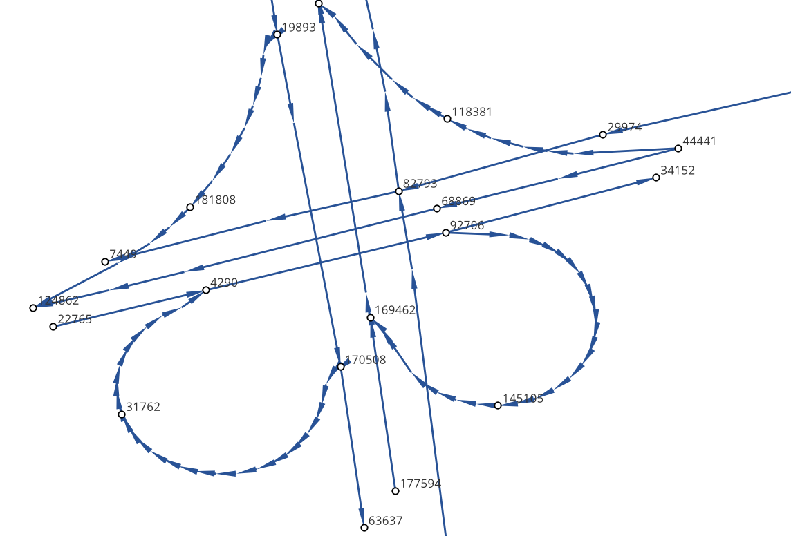
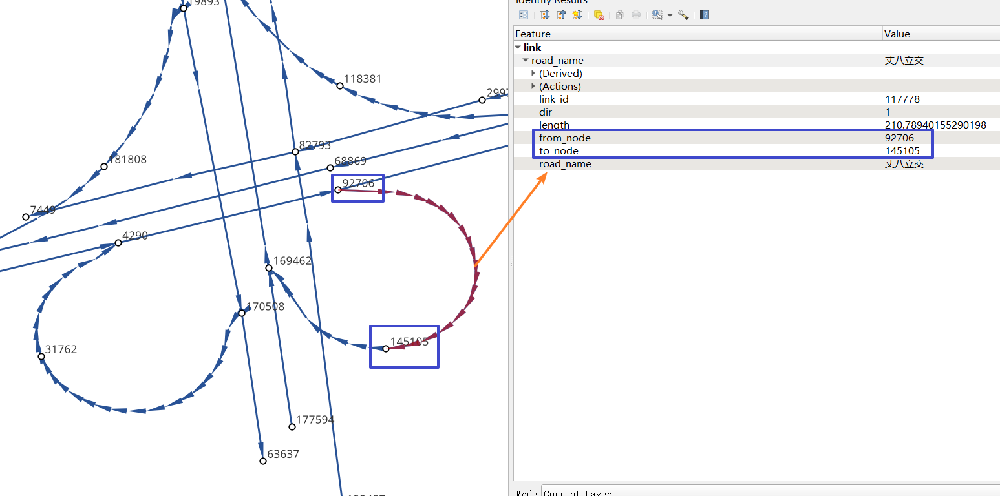

如何使用
===================================


1. 安装gotrackit
--------------------

安装前确保python环境中有以下前置依赖库

括号中为作者使用版本(基于python3.11)，仅供参考

* geopandas(0.14.1)

* gdal(3.4.3)

* networkx(3.2.1)

* shapely(2.0.2)

* pandas(2.0.3)

* numpy(1.26.2)

* pyproj(3.6.1)

* keplergl(0.3.2)


geopandas为最新版本, 如果不是最新版本可能会报错(有个函数旧版本没有)

使用pip安装 ::

    pip install -i https://pypi.org/simple/ gotrackit


2. 算法包概览
--------------------

2.1. 模块概览
````````````````
包括了三个模块：数据生产、地图匹配和可视化。


2.1.1. GPS数据生产
::::::::::::::::::::::::::
该模块依托路网文件模拟车辆行驶并且产生GPS数据，当用户没有实际的GPS数据时可以借助该模块生产数据。


2.1.2. 地图匹配
::::::::::::::::::::::::::
依托路网文件、GPS数据，对GPS数据进行地图匹配，匹配结果给出每个GPS点实际匹配路段信息。


2.1.3. kepler可视化
::::::::::::::::::::::::::
依托匹配结果生产HTML文件，用户可以使用浏览器打开该文件播放匹配动画。


2.2. 数据要求
````````````````

这三个模块所涉及的数据说明如下：

2.2.1. 路网数据
::::::::::::::::::::::::::
路网由线层文件和点层文件组成，两个文件存在关联关系。


(1) 路网-点层
'''''''''''''

路网点层文件字段要求如下：

.. csv-table:: 节点层字段说明
    :header: "字段名称", "字段类型", "字段说明"
    :widths: 15, 15, 40

    "node_id","int","节点唯一编码"
    "geometry","geometry","节点坐标几何列"
    "其他非必需字段","...","..."

样例数据如下：

.. csv-table:: 节点样例数据
    :header: "node_id", "geometry"
    :widths: 3, 20

    "4290","POINT (108.84059274796762 34.20380728755708)"
    "7449","POINT (108.83996876020116 34.20398312458892)"
    "19893","POINT (108.8410333043887 34.20538952458989)"
    "22765","POINT (108.8396462868452 34.20358068920948)"
    "29974","POINT (108.84304743483109 34.20477124733548)"
    "31762","POINT (108.84007099594207 34.20303962600771)"
    "34152","POINT (108.84337595161946 34.20450390550994)"
    "44441","POINT (108.8435151462407 34.204686083275455)"
    "63637","POINT (108.8415703783543 34.20233450491169)"
    "68869","POINT (108.842021912175 34.20431362229388)"
    "82793","POINT (108.84178453991281 34.204420171642816)"
    "91199","POINT (108.84129068661863 34.20558291058989)"
    "92706","POINT (108.84207500541686 34.2041637658475)"
    "118381","POINT (108.84208596575294 34.20486654570958)"
    "122487","POINT (108.84210722600966 34.20202954576994)"
    "124862","POINT (108.83952308374874 34.20369843029777)"
    "145105","POINT (108.84239758378014 34.20309169152201)"
    "166381","POINT (108.84139277469502 34.20644679433629)"
    "169462","POINT (108.84160833213731 34.20363712972413)"
    "170508","POINT (108.841425074665 34.203330912749905)"
    "177594","POINT (108.84176365682967 34.202564765029564)"
    "181808","POINT (108.84049555540867 34.20432194107051)"
    "191714","POINT (108.84048418194278 34.208751404812496)"
    "198856","POINT (108.84627615033686 34.205495498912406)"
    "199563","POINT (108.84081270761097 34.208564048548254)"

(2) 路网-线层
'''''''''''''

路网线层文件字段要求如下：

.. csv-table:: 线层字段说明
    :header: "字段名称", "字段类型", "字段说明"
    :widths: 10, 10, 30

    "link_id","int","路段唯一编码"
    "from_node","int","路段拓扑起点节点编号"
    "to_node","int","路段拓扑终点节点编号"
    "dir","int","路段方向，取值为0或者1， 0代表双向通行，1代表通行方向为路段拓扑正向"
    "length","float","路段长度，单位米"
    "geometry","geometry","路段几何线型"
    "其他非必需字段","...","..."


样例数据如下：

.. csv-table:: 线层样例数据
    :header: "link_id", "dir", "length", "from_node", "to_node", "road_name", "geometry"
    :widths: 5, 5,5,5,5,5,40

    "50542","1","379.03","191714","19893","西三环入口","LINESTRING (108.84048418194278 34.208751404812496, 108.8410333043887 34.20538952458989)"
    "50545","1","112.13","170508","63637","西三环入口","LINESTRING (108.841425074665 34.203330912749905, 108.8415703783543 34.20233450491169)"
    "91646","1","120.66","177594","169462","西太公路","LINESTRING (108.84176365682967 34.202564765029564, 108.84160833213731 34.20363712972413)"
    "117776","1","91.19","22765","4290","科技八路","LINESTRING (108.8396462868452 34.20358068920947, 108.84059274796762 34.20380728755708)"
    "117777","1","142.87","4290","92706","科技八路","LINESTRING (108.84059274796762 34.20380728755708, 108.84207500541686 34.2041637658475)"
    "225724","1","126.28","92706","34152","科技八路","LINESTRING (108.84207500541686 34.2041637658475, 108.84337595161946 34.20450390550994)"
    "353809","1","309.67","198856","29974","科技八路辅路","LINESTRING (108.84627615033686 34.205495498912406, 108.84304743483109 34.20477124733548)"
    "353810","1","123.30","29974","82793","科技八路辅路","LINESTRING (108.84304743483109 34.20477124733548, 108.84178453991281 34.204420171642816)"
    "50543","1","232.85","19893","170508","西三环入口","LINESTRING (108.8410333043887 34.20538952458989, 108.84113550636526 34.204842890573545, 108.841425074665 34.203330912749905)"
    "60333","1","131.43","19893","181808","丈八立交","LINESTRING (108.8410333043887 34.20538952458989, 108.84097922452833 34.2053414459058, 108.8409571929787 34.20530941808315, 108.84094718092301 34.205266415141416, 108.84093116775695 34.205121436415766, 108.84088210545373 34.20495040838689, 108.84082903440334 34.20481036268511, 108.84074291369149 34.204649265874245, 108.84062975122784 34.20448312297699, 108.84049555540867 34.20432194107051)"
    "60342","1","114.48","181808","124862","丈八立交","LINESTRING (108.84049555540867 34.20432194107051, 108.84036636411828 34.20419775516095, 108.84024318008004 34.20409657182006, 108.84004387862637 34.203972261359624, 108.83952308374874 34.20369843029777)"
    "72528","1","144.36","44441","68869","科技八路","LINESTRING (108.8435151462407 34.204686083275455, 108.84276803395724 34.20449685714005, 108.842021912175 34.20431362229388)"
    "72530","1","241.31","68869","124862","科技八路","LINESTRING (108.842021912175 34.20431362229388, 108.84045752847501 34.20392001061749, 108.83999080892261 34.20380622377766, 108.83952308374874 34.20369843029777)"
    "91647","1","219.39","169462","91199","西太公路","LINESTRING (108.84160833213731 34.20363712972413, 108.84159129993026 34.20371207446149, 108.84158127801764 34.20379302941826, 108.84129068661863 34.20558291058989)"
    "91650","1","336.01","91199","199563","西太公路","LINESTRING (108.84129068661863 34.20558291058989, 108.8412796652767 34.20563687282872, 108.8412686439326 34.205690835063145, 108.84115642068461 34.20631242560034, 108.84081270761097 34.208564048548254)"
    "117778","1","210.78","92706","145105","丈八立交","LINESTRING (108.84207500541686 34.2041637658475, 108.84246760555624 34.204148454345315, 108.84259079504238 34.204121677386546, 108.84270897833433 34.204073898662514, 108.84278409570048 34.20403104344158, 108.84285420666204 34.203972184904536, 108.84290829376307 34.20390730060347, 108.84296138178485 34.20381142505641, 108.84298842958638 34.20372550103973, 108.84300445983821 34.203650554222975, 108.8430044667493 34.203564583429824, 108.84298844855175 34.20348958118876, 108.84295640699884 34.20340355495798, 108.84291334698771 34.20333950217767, 108.84283823977152 34.203258399651446, 108.84274109807303 34.203189254785585, 108.84262893217804 34.20313507862982, 108.84249973838324 34.20310286525956, 108.84239758378014 34.20309169152201)"
    "117796","1","101.54","145105","169462","丈八立交","LINESTRING (108.84239758378014 34.20309169152201, 108.84226337833424 34.20310245441332, 108.84214018818257 34.20312823114287, 108.84201599437151 34.20317699810311, 108.84191984203596 34.20324080868778, 108.84186074674892 34.20329968553512, 108.84168846217199 34.20355129904852, 108.84166642567236 34.203584249318894, 108.84160833213731 34.20363712972413)"
    "142834","1","137.18","44441","118381","丈八立交","LINESTRING (108.8435151462407 34.204686083275455, 108.84286516861593 34.20465297225673, 108.84270392291693 34.20466868749383, 108.84255369259174 34.20469541771726, 108.8423543849143 34.204749053102546, 108.84220415103883 34.204807771645406, 108.84208596575294 34.20486654570958)"
    "142840","1","109.65","118381","91199","丈八立交","LINESTRING (108.84208596575294 34.20486654570958, 108.84193572856508 34.20495725275265, 108.84187062536941 34.20500012448543, 108.84174241973271 34.205111862398475, 108.84152206339351 34.2053314019811, 108.84138183320681 34.205508095978935, 108.84129068661863 34.20558291058989)"
    "313011","1","185.48","170508","31762","丈八立交","LINESTRING (108.841425074665 34.203330912749905, 108.84138201087228 34.20329884814687, 108.8413549721588 34.20326181330508, 108.84133394278078 34.20322378932678, 108.84130691144021 34.20309478566952, 108.84126886083386 34.20299375316963, 108.84121578539629 34.2029126874992, 108.84113566851988 34.20282657599954, 108.84107557946284 34.2027784867213, 108.84098444236022 34.20272934315392, 108.84090432074107 34.20269821275392, 108.84078013032108 34.202671003329115, 108.84065193124133 34.202670777488386, 108.84052272903759 34.202686544240095, 108.8404205674005 34.20271835309855, 108.84031840430188 34.20276615639653, 108.84024328324365 34.202814007367984, 108.84015714222738 34.20289482758925, 108.8401090614738 34.20296471879859, 108.84007099594207 34.20303962600771)"
    "313030","1","107.96","31762","4290","丈八立交","LINESTRING (108.84007099594207 34.20303962600771, 108.84004995701892 34.20311456333897, 108.84003893335381 34.20319451669712, 108.84004393467363 34.203275498082384, 108.8400609552723 34.203350502775116, 108.8401090222339 34.20345255324469, 108.8401681085395 34.20352763233158, 108.8402271964761 34.2035817184994, 108.84032334095258 34.20365086500884, 108.84044152120677 34.20370005708676, 108.84059274796762 34.20380728755708)"
    "336493","1","268.77","122487","82793","西三环辅路","LINESTRING (108.84210722600966 34.20202954576994, 108.84186570306134 34.20393847725639, 108.84178453991281 34.204420171642816)"
    "336495","1","229.43","82793","166381","西三环辅路","LINESTRING (108.84178453991281 34.204420171642816, 108.84169935963888 34.205036812701614, 108.84162421311767 34.20542354934598, 108.84139277469502 34.20644679433629)"
    "353811","1","175.06","82793","7449","科技八路辅路","LINESTRING (108.84178453991281 34.204420171642816, 108.8409632885549 34.20423679420731, 108.83996876020116 34.20398312458892)"


(2) 点层、线层关联关系
''''''''''''''''''''''''''

按照以上样例数据准备路网文件,shp、csv、geojson等格式都可以

样例数据在QGIS(或者TransCAD等其他GIS软件)中进行可视化，大概是这个样子



* 线层dir字段与拓扑方向
    线层的箭头方向为拓扑方向(即link层geometry中的折点行进方向)，dir字段所描述的行车方向就是与之关联的，dir为1代表该条link是单向路段，行车方向与拓扑方向一致，dir为0代表该条link是双向路段


* 点层node_id与线层from_node、to_node关联
    线层的箭头方向为拓扑方向(即link层geometry中的折点行进方向)，dir字段所描述的行车方向就是与之关联的，dir为1代表该条link是单向路段，行车方向与拓扑方向一致，dir为0代表该条link是双向路段



-------------------------------------

在本地图匹配包中，使用Net对象来管理路网，用户需要指定Link层和Node层文件路径或者传入link层和node层的GeoDataFrame，便可以创建一个Net对象，这个Net对象是我们开展GPS数据生产、地图匹配的基准Net，这个Net对象提供了很多操作路网的方法，方便我们对路网进行操作。


2.2.2. GPS定位数据
::::::::::::::::::::::::::


GPS字段要求如下：

.. csv-table:: GPS数据字段说明
    :header: "字段名称", "字段类型", "字段说明"
    :widths: 15, 15, 40

    "agent_id","string","节点唯一编码"
    "lng","float","经度"
    "lat","float","纬度"
    "time","string","节点坐标几何列"
    "heading","float","航向角,该字段不是必须字段"
    "其他非必需字段","...","..."


3. 生产GPS数据
--------------------

3.1. 输入数据
`````````````


(3) GPS数据
'''''''''''''


3.2. 输入数据
`````````````

3.3. 代码示例
`````````````

.. code-block:: python
    :linenos:

    import pandas as pd


4. 从路径规划接口获取路网
-------------------------


5. 地图匹配
----------------------------
使用地图匹配接口，你需要准备路网数据和GPS数据


5. 匹配结果可视化
----------------------------